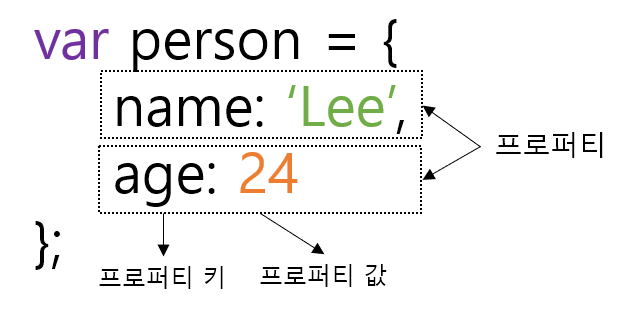
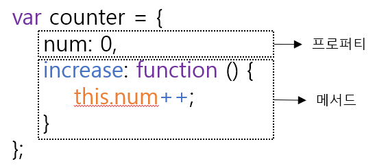

# 10장. 객체 리터럴

#### 10.1 객체란?

원시 타입은 단 하나의 값만 나타내지만 객체 타입은 다양한 타입의 값(원시 값 또는 다른 객체)을 하나의 단위로 구성한 복합적인 자료구조다.

**원시 타입의 값, 즉 원시 값은 변경 불가능한 값(immutable value)이지만 객체 타입의 값, 즉 객체는 변경 가능한 값(mutable value)**


객체는 0개 이상의 프로퍼티로 구성된 집합이며, 프로퍼티는 키와 값으로 구성된다.



자바스크립트에서 사용할 수 있는 모든 값은 프로퍼티 값이 될 수 있다. 함수도 프로퍼티 값으로 사용될 수 있는데, 프로퍼티 값이 함수일 경우 일반 함수와 구분하기 위해 메서드(method)라 부른다.



프로퍼티 : 객체의 상태를 나타내는 값(data)

메서드 : 프로퍼티(상태 데이터)를 참조하고 조작할 수 있는 동작(behavior)


#### 10.2 객체 리터럴에 의한 객체 생성

자바스크립트에서 지원하는 객체 생성 방법

- 객체 리터럴 : 일반적인 방법
- Object  생성자 함수
- 생성자 함수
- Object.create 메서드
- 클래스(ES6)

객체 리터럴은 중괄호({...}) 내에 0개 이상의 프로퍼티를 정의한다. 변수에 할당되는 시점에 자바스크립트 엔진은 객체 리터럴을 해석해 객체를 생성한다.

```javascript
var person = {
	name: 'Lee',
    sayHello: function () {
        console.log(`Hello! My name is ${this.name}.`);
    }
};
console.log(typeof person); // object
console.log(person); // {name: "Lee", sayHello: f}
```

객체 리터럴은 자바스크립트의 유연함과 강력함을 대표하는 객체 생성 방식이다. 

객체를 생성하기 위해 클래스를 먼저 정의하고 new 연산자와 함께 생성자를 호출할 필요가 없다. 

객체 리터럴에 프로퍼티를 포함시켜 객체를 생성함과 동시에 프로퍼티를 만들 수도 있고, 객체를 생성한 이후에 프로퍼티를 동적으로 추가할 수도 있다.


#### 10.3 프로퍼티

프로퍼티 키 : 빈 문자열을 포함하는 모든 문자열 또는 심벌 값

프로퍼티 값 : 자바스크립트에서 사용할 수 있는 모든 값


프로퍼티 키는 프로퍼티 값에 접근할 수 있는 이름으로서 식별자 역할을 한다. 식별자 네이밍 규칙을 반드시 따라야 하는 것은 아니지만, 가끔 예상치 못한 번거로운 일이 나타날 수도 있다. 또한 식별자 네이밍 규칙을 따르지 않는 이름에는 반드시 따옴표를 사용해야 한다.

```javascript
var person = {
    firstName : 'Riley', // 식별자 네이밍 규칙을 준수하는 프로퍼티 키
    'last-name': 'Lee'  // 식별자 네이밍 규칙을 준수하지 않은 프로퍼티 키
}
console.log(person); // {firstName: "Riley", last-name: "Lee"}
```

만약 last-name을 따옴표를 생략한다면 자바스크립트 엔진은 last-name을 - 연산자가 있는 표현식으로 해석한다.

또한 이미 존재하는 프로퍼티 키를 중복 선언하면 나중에 선언한 프로퍼티가 먼저 선언한 프로퍼티를 덮어쓴다.

이때 에러는 발생하지 않는다.

```javascript
var foo = {
    name: "Lee",
    name: "Kim"
}
console.log(foo); // {name: "Kim"}
```


#### 10.4 메서드

프로퍼티 값이 함수일 경우 일반 함수와 구분하기 위해 메서드라 부른다. 즉, 메서드는 객체에 묶여 있는 함수를 의미한다.

```javascript
var circle = {
    radius: 5, // 프로퍼티
    getDiameter: function () { // 메서드
        return 2 * this.radius; // this는 circle을 가리킨다.
    }
};
console.log(circle.getDiameter()); // 10
```


#### 10.5 프로퍼티 접근

프로퍼티에 접근하는 방법은 두 가지이다.

1. 마침표 프로퍼티 접근 연산자(.)를 사용하는 마침표 표기법
2. 대괄호 프로퍼티 접근 연산자([...])를 사용하는 대괄호 표기법

```javascript
var person = {
    name: "Lee"
};
// 1번 마침표 표기법
console.log(person.name);
// 2번 대괄호 표기법
console.log(person['name']);
```

**대괄호 프로퍼티 접근 연산자 내부에 지정하는 프로퍼티 키는 반드시 따옴표로 감싼 문자열이어야 한다.**아니면 ReferenceError 발생

객체에 존재하지 않는 프로퍼티에 접근하면 undefined를 반환한다.

```javascript
var person = {
    name: "Lee"
};
console.log(person.age); // undefined
```


#### 10.6 프로퍼티 값 갱신

이미 존재하는 프로퍼티에 값을 할당하면 프로퍼티 값이 갱신된다.

```javascript
var person = {
    name: 'Lee'
};
person.name = 'Kim';
console.log(person); // {name: "Kim"}
```


#### 10.7 프로퍼티 동적 생성

존재하지 않는 프로퍼티에 값을 할당하면 프로퍼티가 동적으로 생성되어 추가되고 프로퍼티 값이 할당된다.

```javascript
var person = {
    name: 'Lee'
};
person.age = 20;
console.log(person); // {name: "Kim", age: 20}
```


#### 10.8 프로퍼티 삭제

delete 연산자는 객체의 프로퍼티를 삭제한다. 이때 delete 연산자의 피연산자는 프로퍼티 값에 접근할 수 있는 표현식이어야 한다. 만약 존재하지 않는 프로퍼티를 삭제하면 아무런 에러 없이 무시된다.

```javascript
var person = {
    name: 'Lee'
};
person.age = 20;

delete person.age;
delte person.address; // 무시

console.log(person); // {name: "Kim"}
```


