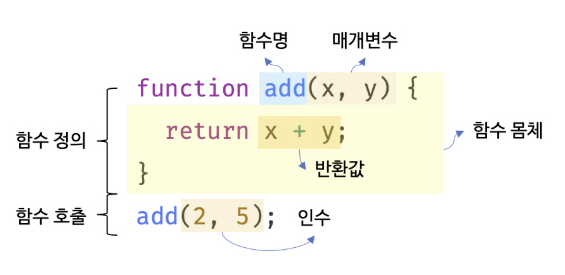

# 12장. 함수

#### 12.1 함수란?

프로그래밍 언어의 함수는 **일련의 과정을 문(statement)으로 구현하고 코드 블록으로 감싸서 하나의 실행 단위로 정의한 것**이다.

프로그래밍 언어의 함수도 수학의 함수처럼 입력을 받아서 출력을 내보낸다.

이때 함수 내부로 입력을 전달받는 변수를 **매개변수(parameter)**, 입력을 **인수(argument)**, 출력을 **반환값(return value)**이라 한다.

또한 함수는 값이며, 여러 개 존재할 수 있으므로 특정 함수를 구별하기 위해 식별자인 함수 이름을 사용할 수 있다.

함수는 **함수 정의**를 통해 생성된다. 

함수 정의만으로 함수가 실행되는 것은 아니다. 수학의 함수처럼 미리 정의된 일련의 과정을 실행하기 위해 필요한 입력, 즉 인수를 매개변수를 통해 함수에 전달하면서 함수의 실행을 명시적으로 지시해야 한다. 이를 **함수 호출**이라 한다.



#### 12.2 함수를 사용하는 이유

1. 함수는 필요시 여러 번 호출이 가능하다. 동일한 작업을 반복적으로 수행해야 한다면 함수를 **재사용**하는 것이 효율적이다.
2. 같은 코드를 중복해서 사용하는 것을 함수 하나로 대체하면 코드 수정이나 추가해야 할때, 여러번 할 필요없이 함수하나만 수정이나 추가하면 된다. 따라서, 코드의 중복을 억제하고 재사용성을 높이는 함수는 **유지보수의 편의성**을 높이고 실수를 줄여 **코드의 신뢰성**을 높이는 효과가 있다.
3. 함수는 객체 타입이라 식별자를 붙일 수 있다. 이는 함수의 역할을 이름으로 간접적으로 전달할 수 있는데 이는 **코드의 가독성**을 향상시킨다.


#### 12.3 함수 리터럴

자바스크립트의 함수는 객체 타입의 값이다. 객체를 객체 리터럴로 생성하는 것처럼 함수도 함수 리터럴로 생성할 수 있다.

함수 리터럴은 function 키워드, 함수 이름, 매개변수 목록, 함수 몸체로 구성된다.

```javascript
// 변수에 함수 리터럴을 할당
var f = function add(x, y) {
    return x + y;
}
```

함수 리터럴의 구성 요소는 다음과 같다.

**[함수 이름]**

- 함수 이름은 식별자다. 따라서 실벽자 네이밍 규칙을 준수해야 한다.
- 함수 이름은 함수 몸체 내에서만 참조할 수 있는 식별자다.
- 함수 이름은 생략할 수 있다. 이름이 있는 함수를 기명 함수, 이름이 없는 함수를 무명/익명 함수라 한다.

**[매개변수 목록]**

- 0개 이상의 매개변수를 소괄호로 감싸고 쉼표로 구분한다.
- 각 매개변수에는 함수를 호출할 때 지정한 인수가 순서대로 할당된다. 즉, 매개변수 목록은 순서에 의미가 있다.
- 매개변수는 함수 몸체 내에서 변수와 동일하게 취급된다. 따라서 매개변수도 변수와 마찬가지로 식별자 네이밍 규칙을 준수해야 한다.

**[함수 몸체]**

- 함수가 호출되었을 때 일괄적으로 실행될 문들을 하나의 실행 단위로 정의한 코드 블록이다.
- 함수 몸체는 함수 호출에 의해 실행된다.


**함수는 객체다.** 함수는 객체지만 일반 객체와는 다르다. **일반 객체는 호출할 수 없지만 함수는 호출할 수 있다.** 그리고 일반 객체에는 없는 함수 객체만의 고유한 프로퍼티를 갖는다.

함수가 객체라는 사실은 다른 프로그래밍 언어와 구별되는 자바스크립트의 중요한 특징이므로 반드시 기억해두어야한다.


#### 12.4 함수 정의

함수 정의 방식에는 4가지가 있다.

1. 함수 선언문
2. 함수 표현식
3. Function 생성자 함수
4. 화살표 함수(ES6)


##### **[함수 선언문]**

```javascript
function add(x, y) {
    return x + y;
}
// 함수 참조
// console.dir은 함수 객체의 프로퍼티까지 출력된다.
// 단, Node.js 환경에서는 console.log와 같은 결과가 출력된다.
console.dir(add); // f add(x, y)
```

함수 선언문은 함수 리터럴과 형태가 동일하다. 

단, 함수 리터럴은 함수 이름을 생략할 수 있으나 **함수 선언문은 함수 이름을 생략할 수 없다.**

**함수 선언문은 표현식이 아닌 문이다.**

크롬 개발자 도구의 콘솔에서 함수 선언문을 실행하면 완료 값 undefined가 출력된다.


**함수 선언문 vs 함수 리터럴 표현식**

**함수는 함수 이름으로 호출하는 것이 아니라 함수 객체를 가리키는 식별자로 호출한다.**

```javascript
// 기명 함수 리터럴을 단독으로 사용하면 함수 선언문으로 해석된다.
// 함수 선언문은 함수 이름을 생략할 수 없다.
function foo() {console.log('foo')};
foo(); // foo

// 함수 리터럴을 피연산자로 사용하면 함수 선언문이 아니라 함수 리터럴 표현식으로 해석된다.
// 함수 리터럴에서는 함수 이름을 생략 할 수 있다.
(function bar() {console.log('bar')});
bar(); // ReferenceError : bar is not defined
```

함수 리터럴에서 **함수 이름은 함수 몸체 내에서만 참조할 수 있는 식별자**이다. 이는 함수 외부에서는 함수 이름으로 호출 할 수 없다는 것을 의미한다. 함수를 가리키는 식별자가 없다는 것과 마찬가지이다. 그래서 bar()를 호출할 수 없다.

하지만 함수 선언문인 foo()는 호출할 수 있다. 그 이유는 **자바스크립트 엔진이 암묵적으로 foo라는 식별자를 생성한 것**이다.

자바스크립트 엔진은 함수 선언문을 해석해 함수 객체를 생성한다. 이때 함수 객체를 가리키는 식별자가 없으면 함수 객체를 참조할 수도 호출할 수 도 없다. 따라서 **자바스크립트 엔진은 생성된 함수를 생성하기 위해 함수 이름과 동일한 이름의 식별자를 암묵적으로 생성하고, 거기에 함수 객체를 할당한다.**


##### **[함수 표현식]**

자바스크립트의 함수는 일급 객체이다. 함수가 일급객체라는 것은 함수를 값처럼 자유롭게 사용할 수 있다는 의미이다.

```javascript
// 기명 함수 표현식
var add = function(x, y) {
    return x + y;
};
// 함수 객체를 가리키는 식별자로 호출
console.log(add(2, 5)); // 7
// 함수 이름으로 호출하면 ReferenceError가 발생한다.
// 함수 이름은 함수 몸체 내부에서만 유효한 식별자다
console.log(foo(2, 5)); // ReferenceError
```

언뜻보면 자바스크립트 엔진은 함수 선언문의 함수 이름으로 식별자를 암묵적 생성하고 생성된 함수 객체를 할당하므로 함수 표현식과 유사하게 동작하는 것처럼 보인다. 하지만 함수 선언문과 함수 표현식은 정확히 동일하게 동작하지는 않는다.

**함수 선언문은 "표현식이 아닌 문"이고 함수 표현식은 "표현식인 문"이다.**


##### **[Function 생성자 함수]**

```javascript
var add = new Function('x', 'y', 'return x+y');
```

Function 생성자 함수로 함수를 생성하는 방식은 일반적이지 않으며 바람직하지도 않다.

Function 생성자 함수로 생성한 함수는 클로저를 생성하지 않는 등, 함수 선언문이나 함수 표현식으로 생성한 함수와 다르게 동작한다.


##### **[화살표 함수(ES6)]**

```javascript
var add = (x, y) => x + y;
```

화살표 함수는 항상 익명 함수로 정의한다.

화살표 함수는 기존의 함수보다 표현만 간략한 것이 아니라 내부 동작 또한 간략화되어 있다.

화살표 함수는 생성자 함수로 사용할 수 없으며, 기존 함수와  this 바인딩 방식이 다르고, prototype 프로퍼티가 없으며 arguments 객체를 생성하지 않는다.


##### **[함수 생성 시점과 호이스팅]**

```javascript
// 함수 참조
console.dir(add); // f add(x, y)
console.dir(sub); // undefiend
// 함수 호출
console.log(add(2, 5)); // 7
console.log(sub(2, 5)); // TypeError: sub is not a function
// 함수 선언문
function add(x, y) {
    return x + y;
}
// 함수 표현식
var sub = function (x, y) {
    return x - y;
}
```

함수 선언문으로 정의한 함수는 함수 선언문 이전에 호출할 수 있지만, 함수 표현식은 이전에 호출 할 수 없다.

이는 **함수 선언문으로 정의한 함수와 함수 표현식으로 정의한 함수의 생성 시점이 다르기 때문이다.**

함수 선언문으로 함수를 정의하면 런타임 이전에 함수 객체가 먼저 생성된다. 그리고 자바스크립트 엔진은 함수 이름과 동일한 이름의 식별자를 암묵적으로 생성하고 생성된 함수 객체를 할당한다.

**이처럼 함수 선언문이 코드의 선두로 끌어 올려진 것처럼 동작하는 자바스크립트 고유의 특징을 함수 호이스팅이라 한다.**


함수 표현식은 변수에 할당되는 값이 함수 리터럴인 문이다. 따라서 함수 표현식은 변수 선언문과 변수 할당문을 한 번에 기술한 축약 표현과 동일하게 동작한다.

변수 선언은 런타임 이전에 실행되어 undefined로 초기화되지만 **변수 할당문의 값은 할당문이 실행되는 시점, 즉 런타임에 평가되므로 함수 표현식의 함수 리터럴도 할당문이 실행되는 시점에 평가되어 함수 객체가 된다.**

**함수 표현식으로 함수를 정의하면 함수 호이스팅이 발생하는 것이 아니라 변수 호이스팅이 발생한다.**


#### 12.5 함수 호출

함수는 함수를 가리키는 식별자와 한 쌍의 소괄호인 함수 호출 연산자로 호출한다.

##### **[매개 변수와 인수]**

함수를 실행하기 위해 필요한 값을 함수 외부에서 함수 내부로 전달할 필요가 있는 경우, 매개변수를 통해 인수를 전달한다. 

인수는 값으로 평가될 수 있는 표현식이어야 하고, 함수를 호출할 때 지정하며, 개수와 타입에 제한이 없다.

매개변수는 함수를 정의할 때 선언하며, 함수가 호출되면 함수 몸체 내에서 암묵적으로 생성되고 일반 변수와 마찬가지로 undefined로 초기화된 후 인수가 순서대로 할당된다.


##### **[인수 확인]**

```javascript
function add(x, y) {
    return x + y;
}
console.log(add(2)); // NaN
console.log(add('a', 'b')) // 'ab'
```

위 코드는 개발자의 의도와는 상관없이 문법상 어떠한 문제도 없으며 자바스크립트 엔진은 아무런 문제없이 위 코드를 실행할 것이다.

그 이유는

1. 자바스크립트 함수는 매개변수와 인수의 개수가 일치하는지 확인하지 않는다.
2. 자바스크립트는 동적 타입 언어다. 따라서 자바스크립트 함수는 매개변수의 타입을 사전에 지정할 수 없다.

따라서 자바스크립트의 경우 함수를 정의할 때 적절한 인수가 전달되었는지 확인할 필요가 있다.

```javascript
function add(x, y) {
    if (typeof x !== 'number' || typeof y !== 'number') {
        throw new TypeError('인수는 모두 숫자 값이어야 합니다.');
    }
    return x + y;
}
console.log(add(2)); // TypeError : 인수는 모두 숫자 값이어야 합니다.
console.log(add('a', 'b')) // TypeError : 인수는 모두 숫자 값이어야 합니다.
```


##### **[매개변수의 최대 개수]**

ECMAScript 사양에서는 매개변수의 최대 개수에 대해 명시적으로 제한하고 있지 않다.

매개변수는 순서에 의미가 있다. 따라서 매개변수가 많아지면 함수를 호출할 때 전달해야 할 인수의 순서를 고려해야 한다. 이는 함수의 사용법을 어렵게 만들기 때문에 실수할 가능성이 크다. 그래서 유지보수성이 나빠진다.

이상적인 매개변수 개수는 0개이며 적을수록 적다.

**함수는 한가지 일만 해야 하며 가급적 작게 만들어야 한다.**

많은 수의 매개변수가 필요하다면 하나의 매개변수를 선언하고 객체를 인수로 전달하는 것이 유리하다.

**객체를 인수로 전달하는 예**

```javascript
$.ajax({
    method: 'POST',
    url: '/user',
    data: {id : 1, name: 'Lee'},
    cache: false
});
```

주의해야 할 것은 함수 외부에서 함수 내부로 전달한 객체를 함수 내부에서 변경하면 함수 외부의 객체가 변경되는 부수 효과가 발생한다.


##### **[반환문]**

함수는 return 키워드와 표현식으로 이뤄진 반환문을 사용해 실행 결과를 함수 외부로 반환(return)할 수 있다.

반환문은 두가지 역할을 한다.

1. 반환문은 함수의 실행을 중단하고 함수 몸체를 빠져나간다. 따라서 반환문 이후에 다른 문이 존재하면 그 문은 실행되지 않고 무시된다.

```javascript
function multiply(x, y) {
    return x * y;
    // 반환문 이후에 다른문이 존재하면 그 문은 실행되지 않고 무시된다.
    console.log('실행되지 않는다.');
}
console.log(multiply(3, 5)); // 15
```

2. 반환문은 return 키워드 뒤에 오는 표현식을 평가해 반환한다. 

   return 키워드 뒤에 반환값으로 사용할 표현식을 명시적으로 지정하지 않으면 undefined가 반환된다.

   ```javascript
   function foo () {
       return;
   }
   console.log(foo()); // undefined
   ```

   반환문은 생략할 수 있다. 이 때 함수는 함수 몸체의 마지막 문까지 실행한 후 암묵적으로 undefined를 반환한다.

   ```javascript
   function foo () {
   	// 반환문을 생략하면 암묵적으로 undefined가 반환된다.
   }
   console.log(foo()); // undefined
   ```

   return 키워드와 반환값으로 사용할 표현식 사이에 줄바꿈이 있으면 세미콜론 자동 삽입 기능에 의해 세미콜론이 추가되어 다음과 같은 의도치 않은 상황이 생길 수 있다.

   ```javascript
   function multiply(x, y) {
       //return 키워드와 반환값 사이에 줄바꿈이 있으면
       return // 세미콜론 자동 삽입 기능(ASI)에 의해 세미콜론이 추가된다. 
       x* y; // 무시된다.
   }
   console.log(multiply(3, 5)) // undefined
   ```

   반환문은 함수 몸체 내부에서만 사용할 수 있다. 전역에서 반환문을 사용하면 문법 에러가 발생한다.


#### 12.6 참조에 의한 전달과 외부 상태의 변경

"원시 값과 객체의 비교"에서 봤듯이 원시 값은 값에 의한 전달, 객체는 참조에 의한 전달 방식으로 동작한다.

매개변수도 동일하다.

```javascript
// 매개변수 primitive는 원시값을 전달받고, 매개변수 obj는 객체를 전달받는다.
function changeVal(primitive, obj) {
  primitive += 100;
  obj.name = 'Kim';
}

// 외부 상태
var num = 100;
var person = { name: 'Lee' };

console.log(num); // 100
console.log(person); // {name: "Lee"}

// 원시값은 값 자체가 복사되어 전달되고 객체는 참조값이 복사되어 전달된다.
changeVal(num, person);

// 원시값은 원본이 훼손되지 않는다.
console.log(num); // 100

// 객체는 원본이 훼손된다.
console.log(person); // {name: "Kim"}
```

위 예제에서 함수가 외부 상태(person 변수)는 객체를 할당했기 때문에 변경하면 원본이 훼손되어, 상태변화를 추적하기가 어려워진다. 

이를 위한 해결 방안 중 하나는 객체를 불변 객체로 만들어 사용하는 것이다. 원본 객체를 완전히 복제, 즉 깊은 복사를 통해 새로운 객체를 생성하고 재할당을 통해 교체한다. 이를 통해 외부 상태가 변경되는 부수 효과를 없앨 수 있다.


#### 12.7 다양한 함수의 형태

##### **[즉시 실행 함수]**

함수 정의와 동시에 즉시 호출되는 함수를 즉시 실행 함수라고 한다. 즉시 실행 함수는 단 한 번만 호출되며 다시 호출할 수 없다.

즉시 실행 함수는 함수 이름이 없는 익명 함수를 사용하는 것이 일반적이다. 또한 반드시 그룹 연산자(...)로 감싸야 한다.

```javascript
//익명 즉시 실행 함수
(function () {
    var a = 3;
    var b = 5;
    return a * b;
}());
```

즉시 실행 함수도 일반 함수처럼 값을 반환할 수 있고, 인수를 전달할 수도 있다.

```javascript
// 즉시 실행 함수도 일반 함수처럼 값을 반환할 수 있다.
var res = (function () {
  var a = 3;
  var b = 5;
  return a * b;
}());

console.log(res); // 15

// 즉시 실행 함수에도 일반 함수처럼 인수를 전달할 수 있다.
res = (function (a, b) {
  return a * b;
}(3, 5));

console.log(res); // 15
```


##### **[재귀 함수]**

함수가 자기 자신을 호출하는 것을 재귀 호출이라 한다. 재귀 함수는 자기 자신을 호출하는 행위, 즉 재귀 호출을 수행하는 함수를 말한다.

자기 자신을 호출하는 재귀 함수를 사용하면 반복되는 처리를 반복문 없이 구현할 수 있다. 

팩토리얼은 재귀 함수로 간단하게 구현할 수 있다. 

```javascript
function factorial(n) {
    // 탈출 조건 : n이 1이하일 때 재귀 호출을 멈춘다.
    if (n <= 1) return 1;
    return n * factorial(n - 1); // 재귀 호출
}
countdown(10);
```

재귀 함수는 자신을 무한 재귀 호출한다. 따라서 재귀 함수 내에는 재귀 호출을 멈출 수 있는 **탈출 조건**을 반드시 만들어야 한다.


##### **[중첩 함수]**

함수 내부에 정의된 함수를 중첩 함수 또는 내부 함수라 한다. 그리고 중첩 함수를 포함하는 함수는 외부 함수라 부른다.

중첩 함수는 외부 함수 내부에서만 호출 할 수 있다.

일반적으로 중첩 함수는 자신을 포함하는 외부 함수를 돕는 헬퍼 함수의 역할을 한다.

```javascript
function outer() {
  var x = 1;

  // 중첩 함수
  function inner() {
    var y = 2;
    // 외부 함수의 변수를 참조할 수 있다.
    console.log(x + y); // 3
  }

  inner();
}

outer();
```

ES6부터 함수 선언문을 if문이나 for문 등의 코드 블록 내에서도 정의할 수 있다.

단, 호이스팅으로 인해 혼란이 발생할 수 있으므로 if 문이나 for 문 등의 코드 블록 내에 정의하는 것은 바람직하지 않다.


##### **[콜백 함수]**

```javascript
//n만큼 어떤 일을 반복한다.
function repeat1(n) {
    //i를 출력한다.
    for (var i = 0; i < n; i++) console.log(i);
}
repeat1(5); // 0 1 2 3 4

//n만큼 어떤 일을 반복한다.
function repeat2(n) {
    for (var i = 0; i , n; i++) {
        // i가 홀수일 때만 출력한다.
        if (i % 2) console.log(i);
    }
}
repeat2(5); // 1 3
```

위의 예제는 반복하는 일은 변하지 않고 공통적으로 수행하지만 반복하면서 하는 일의 내용은 다르다. 즉, 함수의 일부분만이 다르기 때문에 매번 함수를 새롭게 정의해야 한다. 이 부분은 함수를 합성하는 것으로 해결할 수 있다.

```javascript
// 외부에서 전달받은 f를 n만큼 반복 호출한다.
function repeat(n, f) {
  for (var i = 0; i < n; i++) {
    f(i); // i를 전달하면서 f를 호출
  }
}

var logAll = function (i) {
  console.log(i);
};

// 반복 호출할 함수를 인수로 전달한다.
repeat(5, logAll); // 0 1 2 3 4

var logOdds = function (i) {
  if (i % 2) console.log(i);
};

// 반복 호출할 함수를 인수로 전달한다.
repeat(5, logOdds); // 1 3
```

repeat 함수는 더이상 내부 로직에 의존하지 않고 외부에서 로직의 일부분을 함수로 전달받아 수행한다.

이처럼 **함수의 매개변수를 통해 다른 함수의 내부로 전달되는 함수를 콜백함수**라고 한다.

또한 **매개변수를 통해 함수의 외부에서 콜백 함수를 전달받은 함수를 고차 함수**라고 한다.


중첩 함수가 외부 함수를 돕는 헬퍼 함수의 역할을 하는 것처럼 콜백 함수도 고차 함수에 전달되어 헬퍼 함수의 역할을 한다.

단, 중첩 함수는 고정되어 있어서 교체하기 곤란하지만 콜백 함수는 함수 외부에서 고차 함수 내부로 주입하기 때문에 자유롭게 교체가 가능하다.

즉, **고차 함수는 콜백 함수를 자신의 일부분으로 합성한다.**

**고차 함수는 매개변수를 통해 전달받은 콜백 함수의 호출 시점을 결정해서 호출한다.** 

**다시 말해, 콜백 함수는 고차 함수에 의해 호출되며 이때 고차 함수는 필요에 따라 콜백 함수에 인수를 전달할 수 있다.**


콜백 함수는 비동기 처리에 활용되는 중요한 패턴이다.

```javascript
// 콜백 함수를 사용한 이벤트 처리
// myButton 버튼을 클릭하면 콜백 함수를 실행한다.
document.getElementById('myButton').addEventListener('click', function () {
  console.log('button clicked!');
});

// 콜백 함수를 사용한 비동기 처리
// 1초 후에 메시지를 출력한다.
setTimeout(function () {
  console.log('1초 경과');
}, 1000);
```

콜백 함수는 비동기 처리뿐 아니라 배열 고차 함수에서도 사용된다.

```javascript
// 콜백 함수를 사용하는 고차 함수 map
var res = [1, 2, 3].map(function (item) {
  return item * 2;
});

console.log(res); // [2, 4, 6]

// 콜백 함수를 사용하는 고차 함수 filter
res = [1, 2, 3].filter(function (item) {
  return item % 2;
});

console.log(res); // [1, 3]

// 콜백 함수를 사용하는 고차 함수 reduce
res = [1, 2, 3].reduce(function (acc, cur) {
  return acc + cur;
}, 0);

console.log(res); // 6
```


##### **[순수 함수와 비순수 함수]**

순수 함수

- 어떤 외부 상태에 의존하지 않고 변경하지도 않는, 부수 효과가 없는 함수
- 동일한 인수가 전달되면 언제나 동일한 값을 반환한다.
- 오직 매개변수를 통해 함수 내부로 전달된 인수에게만 의존해 값을 생성해 반환한다.
- 일반적으로 최소 하나 이상의 인수를 전달받는다.
- 인수의 불변성을 유지한다.

```javascript
var count = 0; // 현재 카운트를 나타내는 상태

// 순수 함수 increase는 동일한 인수가 전달되면 언제나 동일한 값을 반환한다.
function increase(n) {
  return ++n;
}

// 순수 함수가 반환한 결과값을 변수에 재할당해서 상태를 변경
count = increase(count);
console.log(count); // 1

count = increase(count);
console.log(count); // 2
```


비순수 함수

- 외부 상태에 의존하거나 외부 상태를 변경하는, 부수 효과가 있는 함수
- 함수의 외부 상태에 따라 반환값이 달라지는 함수
- 함수 내부에서 외부 상태를 직접 참조하지 않더라도 매개변수를 통해 객체를 전달받는다.

```javascript
var count = 0; // 현재 카운트를 나타내는 상태: increase 함수에 의해 변화한다.

// 비순수 함수
function increase() {
  return ++count; // 외부 상태에 의존하며 외부 상태를 변경한다.
}

// 비순수 함수는 외부 상태(count)를 변경하므로 상태 변화를 추적하기 어려워진다.
increase();
console.log(count); // 1

increase();
console.log(count); // 2
```


함수형 프로그래밍은 순수 함수와 보조 함수의 조합을 통해 외부 상태를 변경하는 부수 효과를 최소화해서 불변성을 지행하는 프로그래밍 패러다임이다. 

자바스크립트는 멀티 패러다임 언어이므로 객체지향 프로그래밍뿐만 아니라 함수형 프로그래밍을 적극적으로 활용하고 있다.
