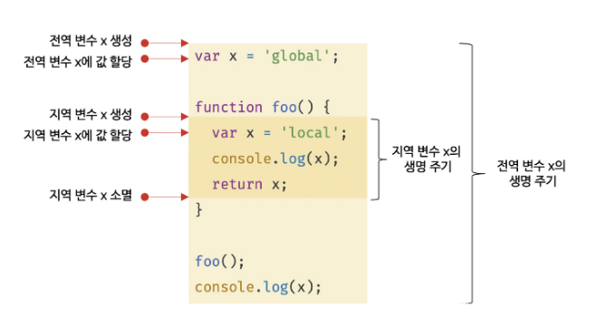

# 14장. 전역 변수의 문제점

#### 14.1 변수의 생명 주기

변수는 선언에 의해 생성되고 할당을 통해 값을 갖는다.

변수에는 생명 주기가 있다. 생명 주기가 없다면 한번 선언된 변수는 프로그램을 종료하지 않는 한 영원히 메모리 공간을 점유하게 된다.

변수는 자신이 자신이 선언된 위치에서 생성되고 소멸한다. 

```javascript
function foo() {
    var x = 'local';
    console.log(x); // local
    return x;
}
foo();
console.log(x); // ReferenceError: x is not defined
```

전역 변수의 생명 주기는 애플리케이션의 생명 주기와 같고, 함수 내부에서 선언된 지역 변수는 함수가 호출되면 생성되고 함수가 종류되면 소멸한다. 즉, **지역 변수의 생명 주기는 함수의 생명 주기와 일치한다.**

```javascript
var x = 'global';
function foo() {
    console.log(x); // (1) undefined
    var x = 'local';
}
foo();
console.log(x); // (2) global
```

위의 예제를 보면 1번에서 출력되는 값은 undefined이다. foo 함수 내부에서 선언된 지역 변수 x는 1번의 시점에 이미 선언되었고 undefined로 초기화되어 있다. 따라서 전역 변수 x를 참조하는 것이 아니라 지역 변수 x를 참조해 변수 할당문이 실행되기 이전까지는 undefined의 값을 가진다.


**호이스팅은 스코프를 단위로 동작한다**. 전역 변수의 호이스팅은 전역 변수의 선언이 전역 스코프의 선두로 끌어 올려진 것처럼 동작하고 지역변수의 호이스팅 또한 마찬가지이다. 즉, **호이스팅은 변수 선언이 스코프의 선두로 끌어 올려진 것처럼 동작하는 자바스크립트 고유의 특징을 말한다.**


##### **[전역 변수의 생명 주기]**

var 키워드로 선언한 전역 변수는 전역 객체의 프로퍼티가 된다. 이는 전역 변수의 생명 주기가 전역 객체의 생명 주기와 일치한다는 것을 말한다.

브라우저 환경에서 전역 객체는 window이므로 브라우저 환경에서 var 키워드로 선언한 전역 변수는 전역 객체 window의 프로퍼티이다.전역 객체 window는 웹페이지를 닫을 때까지 유효하다. 따라서 브라우저 환경에서 var키워드로 선언한 지역 변수는 웹페이지를 닫을 때까지 유효하다.

즉, var 키워드로 선언한 전역 변수의 생명 주기의 전역 객체의 생명 주기와 일치한다.



#### 14.2 전역 변수의 문제점

1. **암묵적 결합**

   전역 변수를 선언한 의도는 코드 어디서든 참조하고 할당할 수 있는 변수를 사용하겠다는 뜻이다. 이는 모든 코드가 전역 변수를 참조하고 변경할 수 있는 암묵적 결합을 허용하는 것이다.  

   변수의 유효 범위가 크면 클수록 코드의 가독성은 나빠지고 의도치 않게 상태가 변경할 수 있는 위험성도 높아진다.

2. **긴 생명 주기**

   전역 변수는 생명 주기가 길다. 따라서 메모리 리소스도 오랜 기간 소비하고 전역 변수의 상태를 변경할 수 있는 시간도 길도 기회도 많다.

   더욱이 var 키워드는 변수의 중복 선언을 허용하므로 변수 이름이 중복될 가성이 있어 의도치 않은 재할당이 이뤄질 수도 있다.

3. **스코프 체인 상에서 종점에 존대**

   전역 변수는 스코프 체인 상에서 종점에 존재한다. 즉, **전역 변수의 검색 속도가 가장 느리다.** 검색 속도의 차이는 크지 않지만 분명 차이는 있다.

4. **네임스페이스 오염**

   자바스크립트는 파일이 분리되어 있다 해도 하나의 전역 스코프를 공유한다는 문제점을 가지고 있다. 따라서 다른 파일 내에서 동일한 이름으로 명명된 전역 변수나 전역 함수가 같은 스코프 내에 존재할 경우 예상치 못한 결과를 가지고 올 수 있다.


#### 14.3 전역 변수의 사용을 억제하는 방법

**전역 변수를 반드시 사용해야 할 이유를 찾지 못한다면 지역 변수를 사용해야 한다. 변수의 스코프는 좁을수록 좋다.**

1. 즉시 실행 함수

   모든 코드를 즉시 실행 함수로 감싸면 모든 변수는 즉시 실행 함수의 지역 변수가 된다.

   ```javascript
   (function () {
       var foo = 10;
       // ...
   })
   console.log(foo); // ReferenceError:  foo is not defined
   ```

   

2. 네임스페이스 객체

   전역에 네임스페이스 역할을 담당할 객체를 생성하고 전역 변수처럼 사용하고 싶은 변수를 프로퍼티로 추가하는 방법이다.

   ```javascript
   var MYAPP = {};
   MYAPP.person = {
       name: 'Lee',
       address: 'Seoul',
   };
   console.log(MYAPP.person.name); // Lee
   ```

   

3. 모듈 패턴

   모듈 패턴은 클래스를 모방해서 관련이 있는 변수와 함수를 모아 즉시 실행 함수로 감싸 하나의 모듈을 만든다.

   모듈 패턴은 클로저를 기반으로 동작한다. 모듈 패턴의 특징은 전역 변수의 억제는 물론 캡슐화가지 구현할 수 있다는 것이다.

   - 캡슐화 : 객체의 상태를 나타내는 프로퍼티와 프로퍼티를 참조하고 조작할 수 있는 동작인 메서드를 하나로 묶는 것을 말한다. 캡슐화는 객체의 특정 프로퍼티나 메서드를 감출 목적으로 사용하기도 하는데 이를 정보 은닉이라 한다.

   모듈 패턴은 전역 네임스페이스의 오염을 막는 기능을 물론 한정적이기는 하지만 정보 은닉을 구현하기 위해 사용한다.

   ```javascript
   var Counter = (function() {
     // private 변수
     var num = 0;
     
     // 외부로 공개할 데이터나 메서드를 프로퍼티로 추가한 객체를 반환한다.
     return {
       increase(){
         return ++num;
       },
       decrease(){
         return --num;
       }
     };
   }());
   
   console.log(Counter.num);	// undefined
   console.log(Counter.increase());	// 1
   console.log(Counter.decrease());	// 0
   ```

   

4. ES6 모듈

   ES6 모듈을 사용하면 더는 전역 변수를 사용할 수 없다. **ES6 모듈은 파일 자체의 독자적인 모듈 스코프를 제공한다.**

   따라서 모듈 내에서 var 키쿼드로 선언한 변수는 더는 전역 변수가 아니며 window 객체의 프로퍼티도 아니다.

   모든 브라우저에서는 ES6 모듈을 사용할 수 있다. script 태그에 type="module" 어트리뷰트를 추가하면 로드된 자바스크립트 파일은 모듈로서 동작한다. 모듈의 파일 확장자는 mjs를 권장한다.

   ```javascript
   <script type="module" src="lib.mjs"></script>
   <script type="module" src="app.mjs"></script>
   ```

   