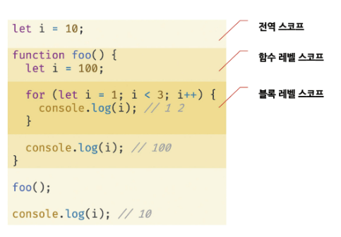
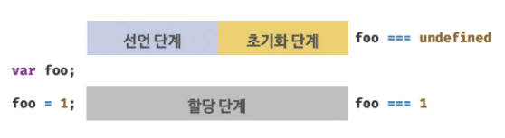
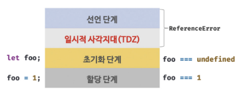

# 15장. let, const 키워드와 블록 레벨 스코프

#### 15.1 var 키워드로 선언한 변수의 문제점

##### **[변수 중복 선언 허용]**

```javascript
var x = 1;
var y = 1;

// var 키워드로 선언된 변수는 같은 스코프 내에서 중복 선언을 허용한다.
// 초기화문이 있는 변수 선언문은 자바스크립트 엔진에 의해 var 키워드가 없는 것처럼 동작한다.
var x = 100;
// 초기화문이 없는 변수 선언문은 무시된다.
var y;

console.log(x); // 100
console.log(y); // 1
```

##### **[함수 레벨 스코프]**

var 키워드로 선언한 변수는 오로지 함수의 코드 블록만을 지역 스코프로 인정한다. 따라서 함수 외부에서 var 키워드로 선언한 변수는 코드 블록 내에서 선언해도 모두 전역 변수가 된다.

```javascript
var x = 1;
if (true) {
    // x는 전역 변수다. 이미 선언된 전역 변수 x가 있으므로 x 변수는 중복 선언된다.
    // 이는 의도치 않게 변수값이 변경되는 부작용을 발생시킨다.
    var x = 10;
}
console.log(x); // 10
```

##### **[변수 호이스팅]**

var 키워드로 변수를 선언하면 변수 호이스팅에 의해 변수 선언문이 스코프의 선두로 끌어 올려진 것처럼 동작한다. 

즉, 변수 호이스팅에 의해 var 키워드로 선언한 변수는 변수 선언문 이전에 참조할 수 있다. 

단, 할당문 이전에 변수를 참조하면 언제나 undefined를 반환한다.

```javascript
// 이 시점에는 변수 호이스팅에 의해 이미 foo 변수가 선언되었다. (1. 선언 단계)
// 변수 foo는 undefined로 초기화된다.(2. 초기화 단계)
console.log(foo); // undefined
// 변수에 값을 할당(3. 할당 단계)
foo = 123;
console.log(foo); // 123
// 변수 선언은 런타임 이전에 자바스크립트 엔진에 의해 암묵적으로 실행된다.
var foo;
```


#### 15.2 let 키워드

##### **[변수 중복 선언 금지]**

let 키워드로 이름이 같은 변수를 중복 선언하면 SyntaxError(문법 에러)가 발생한다.

```javascript
let bar = 123;
// let이나 const 키워드로 선언한 변수는 같은 스코프 내에서 중복 선언을 허용하지 않는다.
let bar = 456; // SyntaxError: Identifier 'bar' has already been declared
```

##### **[블록 레벨 스코프]**

let 키워드로 선언한 변수는 모든 코드 블록(함수, if 문, for 문, while 문, try/catch 문 등)을 지역 스코프로 인정하는 블록 레벨 스코프를 따른다.

```javascript
let foo = 1; // 전역 변수
{
    let foo = 2; // 지역 변수
    let bar = 3; // 지역 변수
}
console.log(foo); // 1
console.log(bar); // ReferenceError: bar is not defined
```


함수도 코드 블록이므로 스코프를 만든다. 이때 함수 내의 코드 블록은 함수 레벨 스코프에 중첩된다.



##### **[변수 호이스팅]**

var 키워드로 선언한 변수와 달리 let 키워드로 선언한 변수는 변수 호이스팅이 발생하지 않는 것처럼 동작한다.

let 키워드의 변수 호이스팅에 대해서 알아보기 전에 var 키워드를 먼저 알아보자.

```javascript
console.log(foo); // undefined
var foo;
console.log(foo); // undefined
foo = 1;
console.log(foo); // 1
```

**var 키워드로 선언한 변수는 런타임 이전에 자바스크립트 엔진에 의해 암묵적으로 "선언 단계"와 "초기화 단계"가 한번에 진행된다.**

따라서 변수 선언문 이전에 변수에 접근해도 스코프에 변수가 존재하기 때문에 에러가 발생하지 않는다. 다만 undefined를 반환한다.




반면에 **let 키워드로 선언한 변수는 "선언 단계"와 "초기화 단계"가 분리되어 진행된다.**

즉, 런타임 이전에 자바스크립트 엔진에 의해 암묵적으로 선언 단계가 먼저 실행되지만 초기화 단계는 변수 선언문에 도달했을 때 실행된다.

초기화 단계가 실행되기 전에 변수에 접근하려고 하면 참조 에러가 발생한다.  let 키워드로 선언한 변수는 스코프의 시작 지점부터 초기화 단계 시작 지점(변수 선언문)까지 변수를 참조할 수 없다. 그리고 그 구간을 **일시적 사각지대(Temporal Dead Zond; TDZ)**라고 부른다.

```javascript
console.log(foo); // ReferenceError: foo is not defined
let foo; // 변수 선언문에서 초기화 단계가 실행된다.
console.log(foo); // undefined
foo = 1; // 할당문에서 할당 단계가 실행된다.
console.log(foo); // 1
```




지금까지의 코드들을 보면 let 키워드로 선언한 변수는 변수 호이스팅이 발생하지 않는 것처럼 보인다. 하지만 그렇지 않다.

```javascript
let foo = 1; // 전역 변수
{
    console.log(foo);// ReferenceError: Cannot access 'foo' before initialization
    let foo = 2; // 지역 변수
}
```

위 예제에서 만약 변수 호이스팅이 일어나지 않는다면 foo의 값은 전역 변수 foo의 갑을 출력해야 한다. 하지만 let 키워드로 선언한 변수도 여전히 호이스팅이 발생하기 때문에 참조 에러가 발생한 것이다.

##### **[전역 객체와  let]**

var  키워드로 선언한 전역 변수와 전역 함수, 그리고 선언하지 않은 변수에 값을 할당한 암묵적 전역은 전역 객체 window의 프로퍼티가 된다.

```javascript
// 이 예제는 브라우저에서 실행해야 한다.
var x = 1; // 전역 변수
y = 2; // 암묵적 전역
function foo() {} // 전역 함수

console.log(window.x); // 1
console.log(x); // 1
console.log(window.y) // 2
console.log(y); // 2
console.log(window.foo); // f foo() {}
console.log(foo); // f foo() {}
```

하지만 let키워드로 선언한 전역 변수는 전역 객체의 프로퍼티가 아니다. 

```javascript
// 이 예제는 브라우저에서 실행해야 한다.
let x = 1;
// let, const 키워드로 선언한 전역 변수는 전역 객체 window의 프로퍼티가 아니다.
console.log(window.x); // undefined
console.log(x); // 1
```


#### 15.3 const 키워드

const 키워드는 상수를 선언하기 위해 사용한다. const 키워드의 특징은 let키워드와 대부분 동일해서 let 키워드와 다른 점을 중심으로 살펴보자.

##### **[선언과 초기화]**

**const 키워드로 선언한 변수는 반드시 선언과 동시에 초기화해야 한다.**

```javascript
const foo = 1;
const bar; // SyntaxError: Missing initializer in const declaration
```

##### **[재할당 금지]**

var 또는 let 키워드로 선언한 변수는 재할당이 자유로우나 **const 키워드로 선언한 변수는 재할당이 금지된다.**

```javascript
const foo = 1;
foo = 2; // SyntaxError: Assignment to constant variable
```

##### **[상수]**

변수의 상대 개념인 **상수는 재할당이 금지된 변수를 말한다.**

**const 키워드로 선언된 변수에 원시 값을 할당한 경우 원시 값은 변경할 수 없는 값이고 const 키워드에 의해 재할당이 금지되므로 할당된 값을 변경할 수 있는 방법은 없다.**

상수는 상태 유지와 가독성, 유지보수의 편의를 위해 적극적으로 사용해야 한다. 

```javascript
// 세전 가격
let preTaxPrice = 100;

// 세후 가격
// 0.1의 의미를 명확히 알기 어렵기 때문에 가독성이 좋지 않다.
let afterTaxPrice = preTaxPrice + (preTaxPrice * 0.1)
console.log(afterTaxPrice); // 110
```

위의 예제에서 0.1은 쉽게 바뀌지 않는 값으며, 프로그램 전체에서 고정된 값을 사용해야 한다.  

```javascript
// 세율을 의미하는 0.1은 변경할 수 없는 상수로서 사용될 값이다.
// 변수 이름을 대문자로 선언해 상수임을 명확히 나타낸다.
const TAX_RATE = 0.1;

// 세전 가격
let preTaxPrice = 100;

// 세후 가격
let afterTaxPrice = preTaxPrice + (preTaxPrice * TAX_RATE)
console.log(afterTaxPrice); // 110
```

0.1의 값을 상수로 표현해서 바꾼 위의 예제는 훨씬 가독성이 좋고 나중에 변경될 때에도 상수만 변경하면 되어서 유지보수성이 좋다.

##### **[const 키워드와 객체]**

const 키워드로 선언된 변수에 원시 값을 할당한 경우 값을 변경할 수 없다. 하지만 **const 키워드로 선언된 변수에 객체를 할당한 경우 값을 변경할 수 있다.**

```javascript
const person = {
    name: 'Lee'
};

// 객체는 변경 가능한 값이다. 따라서 재할당 없이 변경이 가능하다.
person.name = 'Kim';
console.log(person); // {name: "Kim"}
```

const 키워드는 재할당을 금지할 뿐 "불변"을 의미하지는 않는다.


#### 15.4 var vs. let vs. const

변수 선언에는 기본적으로 const를 사용하고 let은 재할당이 필요한 경우에 한정해 사용하는 것이 좋다. 

var와 let, const 키워드는 다음과 같이 사용하는 것을 권장한다.

- ES6를 사용한다면 var 키워드는 사용하지 않는다.
- 재할당이 필요한 경우에 한정해 let 키워드를 사용한다. 이때 변수의 스코프는 최대한 좁게 만든다.
- 변경이 발생하지 않고 읽기 전용으로 사용하는(재할당이 필요 없는 상수) 원시 값과 객체에는 const 키워드를 사용한다. const 키워드는 재할당을 금지하므로 var, let 키워드보다 안전하다.
