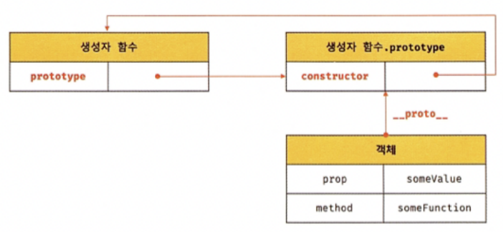
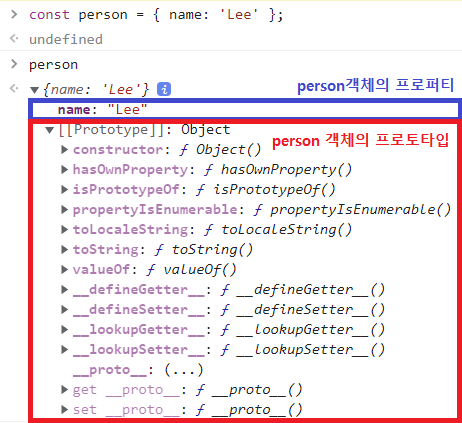
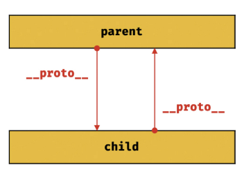
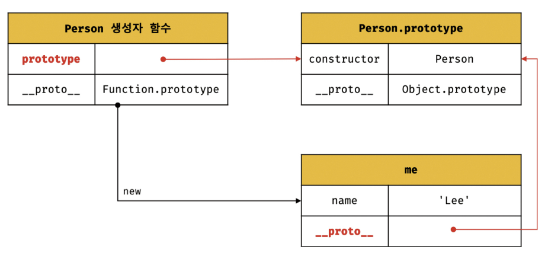
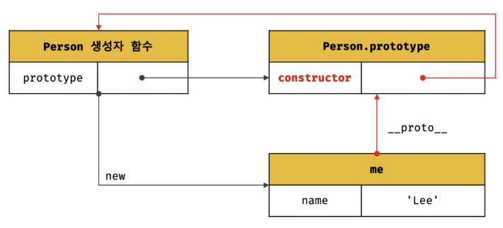
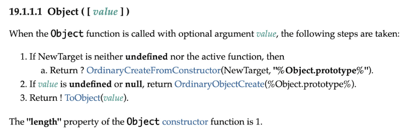
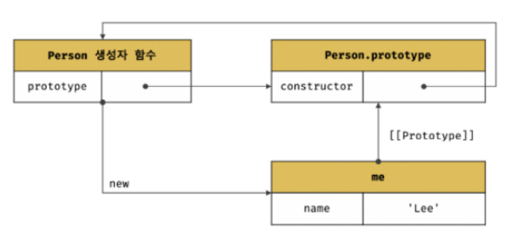
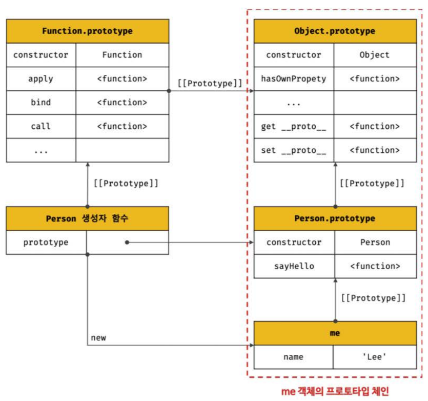
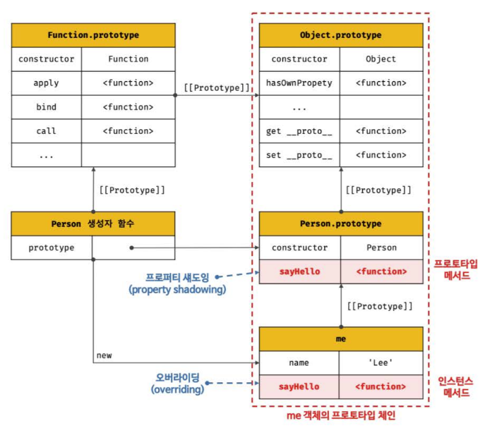
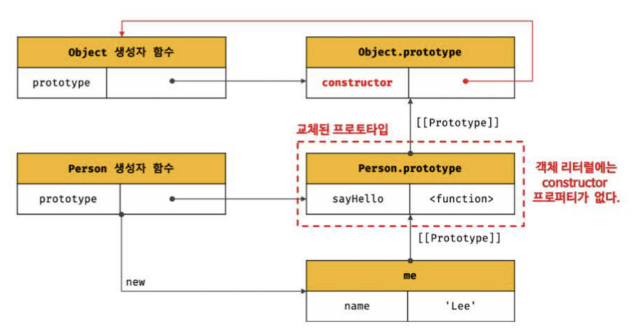

# 19장. 프로토타입

### 19.1 객체 지향 프로그래밍

객체 지향 프로그래밍은 프로그램을 명령어 또는 함수의 목록으로 보는 전통적인 명령형 프로그래밍의 절차지향적 관점에서 벗어나 여러 개의 독립적 단위, 즉 객체의 집합으로 프로그램을 표현하려는 프로그래밍 패러다임.

객체의 상태(status)를 나타내는 데이터와 상태 데이터를 조작할 수 있는 동작을 하나의 논리적인 단위로 묶어 생각한다. 따라서 객체는 상태 데이터와 동작을 하나의 논리적인 단위로 묶은 복합적인 자료구조라고 할 수 있다. 이때 객체의 상태 데이터를 프로퍼티, 동작을 메서드라 부른다.

### 19.2 상속과 프로토타입

상속은 객체지향 프로그램의 핵심 개념으로, 어떤 객체의 프로퍼티 또는 메서드를 다른 객체가 상속받아 그대로 사용할 수 있는 것을 말한다.

자바스크립트는 프로토타입을 기반으로 상속을 구현하여 불필요한 중복을 제거한다.

```javascript
// 생성자 함수
function Circle(radius) {
    this.radius = radius;
    this.getArea = function() {
        //Math.PI는 원주율을 나타내는 상수다.
        return Magh.PI * this.radius ** 2;
    };
}
// 반지름이 1인 인스턴스 생성
const circle1 = new Circle(1);
// 반지름이 2인 인스턴스 생성
const circle2 = new Circle(2);

// Circle 생성자 함수는 인스턴스를 생성할 때마다 동일한 동작을 하는
// getArea 메서드를 중복 생성하고 모든 인스턴스가 중복 소유한다.
// getArea 메서드는 하나만 생성하여 모든 인스턴스가 공유해서 사용하는 것이 바람직하다.
console.log(circle1.getArea === circle2.getArea); // false
```

상속을 통해 불필요한 중복을 없애보자. 자바스크립트는 프로토타입을 기반으로 상속을 구현한다.

```javascript
// 생성자 함수
function Circle(radius) {
    this.radius = radius;
}
// Circle 생성자 함수가 생성한 모든 인스턴스가 getArea 메서드를 공유해서 사용할 수 있도록 프로토타입에 추가한다.
// 프로토타입은 Circle 생성자 함수의 prototype 프로퍼티에 바인딩되어 있다.
Circle.prototype.getArea = function() {
    return Math.PI * this.radius ** 2;
}
// 인스턴스 생성
const circle1 = new Circle(1);
const circle2 = new Circle(2);

// Circle 생성자 함수가 생성한 모든 인스턴스는 부모 객체의 역할을 하는
// 프로토타입 Circle.prototype으로부터 getArea 메서드를 상속받는다.
// 즉, Circle 생성자 함수가 생성하는 모든 인스턴스는 하나의 getArea 메서드를 공유한다.
console.log(circle1.getArea === circle2.getArea); // true
```

Circle 생성자 함수가 생성한 모든 인스턴스는 자신의 프로토타입, 즉 상위(부모) 객체 역할을 하는 Circle.prototype의 모든 프로퍼티와 메서드를 상속받는다.


### 19.3 프로토타입 객체

프로토타입 객체(=프로토타입)란 객체지향 프로그래밍의 근간을 이루는 객체 간 상속을 구현하기 위해 사용된다. 

프로토타입은 어떤 객체의 상위(부모) 객체의 역할을 하는 객체로서 다른 객체에 공유 프로퍼티(메서드 포함)을 제공한다.

모든 객체는 하나의 프로토타입을 갖는다. 그리고 모든 프로토타입은 생성자 함수와 연결되어 있다. 즉, 객체와 프로토타입과 생성자 함수는 서로 연결되어 있다.



#### **[`__proto__` 접근자 프로퍼티]**

모든 객체는 `__proto__`접근자 프로퍼티를 통해 자신의 프로토타입, 즉 [[Prototype]] 내부 슬롯에 간접적으로 접근할 수 있다.



1. `__proto__`는 접근자 프로퍼티다.

   접근자 프로퍼티는 자체적으로 값([[Value]] 프로퍼티 어트리뷰트)을 갖지 않고 다른 데이터 프로퍼티의 값을 읽거나 저장할 때 사용하는 접근자 함수, 즉 [[Get]], [[Set]] 프로퍼티 어트리뷰트로 구성된 프로퍼티다.

   Object.prototype의 접근자 프로퍼티인 `__proto__`는 getter/setter 함수라고 부르는 접근자 함수([[Get]], [[Set]] 프로퍼티 어트리뷰트에 할당된 함수)를 통해 [[Prototype]] 내부 슬롯의 값, 즉 프로토타입을 취득하거나 할당한다.

   ```javascript
   const obj = {};
   const parent = { x: 1 };
   
   // getter 함수인 get __proto__가 호출되어 obj 객체의 프로토타입을 취득
   obj.__proto__;
   // setter 함수인 set __proto__가 호출되어 obj 객체의 프로토타입을 교체
   obj.__proto__ = parent;
   console.log(obj.x) // 1
   ```

   

2. `__proto__`접근자 프로퍼티는 상속을 통해 사용된다.

   `__proto__`접근자 프로퍼티는 객체가 직접 소유하는 프로퍼티가 아니라 Object.prototype의 프로퍼티다.

   모든 객체는 상속을 통해 Object.prototype.`__proto__`접근자 프로퍼티를 사용할 수 있다.

   ```javascript
   const person = { name: 'Lee' };
   
   // person 객체는 __proto__ 프로퍼티를 소유하지 않는다.
   console.log(person.hasOwnProperty('__proto__')); // false
   
   //__proto__ 프로퍼티는 모든 객체의 프로토타입 객체인 Object.prototype의 접근자 프로퍼티다.
   console.log(Object.getOwnPropertyDescriptor(Object.prototype, '__proto__'));
   // { get: f, set: f, enumerable: false, configurable: true}
   
   // 모든 객체는 Object.prototype의 접근자 프로퍼티 __proto__를 상속받아 사용할 수 있다.
   console.log({}.__proto__ === Object.prototype); // true
   ```

   

3. `__proto__`접근자 프로퍼티를 통해 프로토타입에 접근하는 이유

   [[Prototype]] 내부 슬롯의 값, 즉 프로토타입에 접근하기 위해 접근자 프로퍼티를 사용하는 이유는 상호 참조에 의해 프로토타입 체인이 생성되는 것을 방지하기 위해서이다.

   ```javascript
   const parent = {};
   const child = {};
   
   // child의 프로토타입을 parent로 설정
   child.__proto__ = parent;
   // parent의 프로토타입을 child로 설정
   parent.__proto__ = child; // TypeError: Cyclic __proto__ value
   ```

   

프로토타입 체인은 단방향 링크드 리스트로 구현되어야 한다. 즉, 프로퍼티 검색 방향이 한쪽 방향으로만 흘러가야 한다.

위 그림처럼 서로가 자신의 프로토타입이 되어버리면 프로토타입 체인 종점이 존재하지 않기 때문에 프로토타입 체인에서 프로퍼티를 검색할 때 무한 루프에 빠진다.

4. `__proto__`접근자 프로퍼티를 코드 내에서 직접 사용하는 것은 권장하지 않는다.

   모든 객체가 `__proto__`접근자 프로퍼티를 사용할 수 있는 것은 아니기 때문에 직접 사용하는 것은 권장하지 않는다.

   직접 상속을 통해 Object.prototype을 상속받지 않는 객체를 생성할 수도 있기 때문에 `__proto__`접근자 프로퍼티를 사용할 수 없는 경우도 있다.

   ```javascript
   // obj는 프로토타입 체인의 종점이다. 따라서 Object.__proto__를 상속받을 수 없다.
   const obj = Object.create(null)
   
   // obj는 Ojbect.__proto__를 상속받을 수 없다.
   console.log(obj.__proto__); // undefined
   
   // 따라서 __proto__보다 Object.getPrototypeOf 메서드를 사용하는 편이 좋다.
   console.log(Object.getPrototypeOf(obj)); // null
   ```

   **따라서 `__proto__`접근자 프로퍼티 대신 프로토타입의 참조를 취득하고 싶은 경우에는 Object.getPrototypeOf 메서드를 사용하고, 프로토타입을 교체하고 싶은 경우에는 Object.setPrototypeOf 메서드를 사용할 것을 권장한다.**


#### **[함수 객체의 prototype 프로퍼티]**

**함수 객체만이 소유하는 prototype 프로퍼티는 생성자 함수가 생성할 인스턴스의 프로토타입을 가리킨다.**

```javascript
// 함수 객체는 prototype 프로퍼티를 소유한다.
(function () {}).hasOwnProperty('prototype'); // true

// 일반 객체는 prototype 프로퍼티를 소유하지 않는다.
({}).hasOwnProperty('prototype'); // false
```

**모든 객체가 가지고 있는(엄밀히 말하면 Object.prototype으로부터 상속받은) `proto접근자 프로퍼티와 함수 객체만이 가지고 있는 prototype 프로퍼티는 결국 동일한 프로토타입을 가리킨다.** 하지만 이들 프로퍼티를 사용하는 주체가 다르다.

|            구분            |    소유     |        값         |  사용 주체  |                          사용 목적                           |
| :------------------------: | :---------: | :---------------: | :---------: | :----------------------------------------------------------: |
| `__proto__`접근자 프로퍼티 |  모든 객체  | 프로토타입의 참조 |  모든 객체  |   객체가 자신의 프로토타입에 접근 또는 교체하기 위해 사용    |
|     prototype 프로퍼티     | constructor | 프로토타입의 참조 | 생성자 함수 | 생성자 함수가 자신이 생성할 객체(인스턴스)의 프로토타입을 할당하기 위해 사용 |

```javascript
// 생성자 함수
function Person(name) {
    this.name = name;
}
const me = new Person('Lee');

// Person.prototype과 me.__proto__는 결국 아래 그림처럼 동일한 프로토타입을 가리킨다.
console.log(Person.prototype === me.__proto__); // true
```




#### **[프로토타입의 constructor 프로터티와 생성자 함수]**

모든 프로토타입은 constructor 프로퍼티를 갖는다. 이 constructor 프로퍼티는 prototype 프로퍼티로 자신을 참조하고 있는 생성자 함수를 가리킨다. 이 연결은 생성자 함수가 생성될 때, 즉 함수 객체가 생성될 때 이뤄진다.

```javascript
// 생성자 함수
function Person(name) {
    this.name = name;
}
const me = new Person('Lee');
// me 객체의 생성자 함수는 Person이다.
console.log(me.constructor === Person); // true
```




### 19.4 리터럴 표기법에 의해 생성된 객체의 생성자 함수와 프로토타입

리터럴 표기법에 의해 생성된 객체도 물론 프로토타입이 존재한다. 

하지만 리터럴 표기법에 의해 생성된 객체의 경우 프로토타입의 constructor 프로퍼티가 가리키는 생성자 함수가 반드시 객체를 생성한 생성자 함수라고 단정할 수는 없다.

```javascript
// obj 객체는 Object 생성자 함수로 생성한 객체가 아니라 객체 리터럴로 생성했다.
const obj = {};

// 하지만 obj 객체의 생성자 함수는 Object 생성자 함수다.
console.log(obj.constructor === Object); // true
```

위 예제의 obj 객체는 Object 생성자 함수와 constructor 프로퍼티로 연결되어 있다.

그렇다면 객체 리터럴에 의해 생성된 객체는 Object 생성자 함수에 의해 생성되는 것일까?

ECMAScript 사양을 살펴보자.



2번을 보면, Object 생성자 함수에 인수를 전달하지 않거나 undefined 또는 null을 인수로 전달하면서 호출하면 내부적으로는 추상 연산 OrdinaryObjectCreate를 호출하여 Object.prototype을 프로토타입으로 갖는 빈 객체를 생성한다, 라고 나와있다.

```javascript
// 2. Object 생성자 함수에 의한 객체 생성
// 인수가 전달되지 않았을 때 추상 연산 OrdinaryObjectCreate를 호출하여 빈 객체를 생성한다.
let obj = new Object();
console.log(obj); // {}

// 1. new.target이 undefined나 Object가 아닌 경우
// 인스턴스 => Foo.prototype => Object.prototype 순으로 프로토타입 체인이 생성된다.
class Foo extends Object {}
new Foo(); // Foo {}

// 3. 인수가 전달된 경우에는 인수를 객체로 변환한다.
// Number 객체 생성
obj = new Object(123);
console.log(obj); // Number {123}
```

이처럼 Object 생성자 함수 호출과 객체 리터럴의 평가는 추상 연산 OrdinaryObjectCreate를 호출하여 빈 객체를 생성하는 점에서 동일하나 new.target의 확인이나 프로퍼티를 추가하는 처리 등 세부 내용은 다르다. 

따라서 객체 리터럴에 의해 생성된 객체는 Object 생성자 함수가 생성한 객체가 아니다.


함수 객체의 경우 차이가 더 명확하다.

함수 선언문과 함수 표현식을 평가하여 함수 객체를 생성한 것은 Function 생성자 함수가 아니다. 하지만 constructor 프로퍼티를 통해 확인해보면 foo 함수의 생성자 함수는 Function 생성자 함수다.

```javascript
// foo 함수는 Function 생성자 함수로 생성한 함수 객체가 아니라 함수 선언문으로 생성했다.
function foo() {}

// 하지만 constructor 프로퍼티를 통해 확인해보면 함수 foo의 생성자 함수는 Function 생성자 함수다.
console.log(foo.constructor === Function); // true
```

리터럴 표기법에 의해 생성된 객체도 가상적인 생성자 함수를 갖는다. 프로토타입은 생성자 함수와 더불어 생성되며 prototype, constructor 프로퍼티에 의해 연결되어 있기 때문이다.

**프로토타입과 생성자 함수는 단독으로 존재할 수 없고 언제나 쌍(pair)으로 존재한다.**

큰틀에서 생각해 보면 리터럴 표기법으로 생성한 객체도 생성자 함수로 생성한 객체와 본질적인 면에서 큰 차이는 없다. 생성 과정에서 약간의 차이는 있지만 결국 객체로서 동일한 특성을 갖는다. 따라서 프로토타입의  constructor 프로퍼티를 통해 연결되어 있는 생성자 함수를 리터럴 표기법으로 생성한 객체를 생성한 생서자 함수로 생각해도 크게무리는 없다.

리터럴 표기법에 의해 생성된 객체의 생성자 함수와 프로토타입은 다음과 같다.

| 리터럴 표기법      | 생성자 함수 | 프로토타입         |
| ------------------ | ----------- | ------------------ |
| 객체 리터럴        | Object      | Object.prototype   |
| 함수 리터럴        | Function    | Function.prototype |
| 배열 리터럴        | Array       | Array.prototype    |
| 정규 표현식 리터럴 | RegExp      | RegExp.prototype   |


### 19.5 프로토타입의 생성 시점

**프로토타입은 생성자 함수가 생성되는 시점에 더불어 생성된다.** 

#### **[사용자 정의 생성자 함수와 프로토타입 생성 시점]**

생성자 함수로서 호출할 수 있는 함수, 즉 constructor는 함수 정의가 평가되어 함수 객체를 생성하는 시점에 프로토타입도 더불어 생성된다.

```javascript
// 함수 정의(constructor)가 평가되어 함수 객체를 생성하는 시점에 프로토타입도 더불어 생성된다.
console.log(Person.prototype); // {constructor: f}

// 생성자 함수
function Person(name) {
    this.name = name;
}

// 화살표 함수 => non-constructor
const Person = name => {
    this.name = name;
};

// non-constructor는 프로토타입이 생성되지 않는다.
console.log(Person.prototype); // undefined
```

프로토타입도 객체이고 모든 객체는 프로토타입을 가지므로 프로토타입도 자신의 프로토타입을 갖는다. 생성된 프로토타입의 프로토타입은 언제나 Object.prototype이다.

#### **[빌트인 생성자 함수와 프로토타입 생성 시점]**

빌트인 생성자 함수도 일반 함수와 마찬가지로 빌트인 생성자 함수가 생성되는 시점에 프로토타입이 생성된다. 모든 빌트인 생성자 함수는 전역 객체가 생성되는 시점에 생성된다. 생성된 프로토타입은 빌트인 생성자 함수의 prototype 프로퍼티에 바인딩된다.

**생성자 함수 또는 리터럴 표기법으로 객체를 생성하면 프로토타입은 생성된 객체의 [[Prototype]] 내부 슬롯에 할당된다.** 이로써 생성된 객체는 프로토타입을 상속받는다.


### 19.6 객체 생성 방식과 프로토타입의 결정

객체는 다양한 방법으로 생성이 가능하고 각 방식마다 세부적인 생성 방식의 차이는 있으나 추상 연산 OrdinaryObjectCreate에 의해 생성된다는 공통점이 있다.

프로토타입은 추상 연산 OrdinaryObjectCreate에 전달되는 인수에 의해 결정된다. 이 인수는 객체가 생성되는 시점에 객체 생성 방식에 의해 결정된다.

#### **[객체 리터럴에 의해 생성된 객체의 프로토타입]**

자바스크립트 엔진은 객체 리터럴을 평가하여 객체를 생성할 때 추상 연산 OrdinaryObjectCreate를 호출한다. 이때 추상 연산 OrdinaryObjectCreate에 전달되는 프로토타입은 Object.prototype이다. 즉, 객체 리터럴에 의해 생되는 객체의 프로토타입은  Object.prototype이다.

```javascript
consot obj = { x: 1 };

// 객체 리터럴에 의해 생성된 obj 객체는 Object.prototype을 상속받는다.
console.log(obj.constructor === Object); // true
console.log(obj.hasOwnProperty('x')); // true
```

#### **[Object 생성자 함수에 의해 생성된 객체의 프로토타입]**

Object 생성자 함수를 인수 없이 호출하면 빈 객체가 생성된다. Object 생성자 함수를 호출하면 객체 리터럴과 마찬가지로 추상 연산 OrdinaryObjectCreate가 호출된다. 이때 추상 연산 OrdinaryObjectCreate에 전달되는 프로토타입은 Object.prototype이다. 즉, Object 생성자 함수에 의해 생성되는 객체의 프로토타입은  Object.prototype이다.

```javascript
const obj = new Object();
obj.x = 1;

// Object 생성자 함수에 의해 생성된 obj 객체는 Object.prototype을 상속받는다.
console.log(obj.constructor === Object); // true
console.log(obj.hasOwnProperty('x')); // true
```

객체 리터럴과 Object 생성자 함수에 의한 객체 생성 방식의 차이는 프로퍼티를 추가하는 방식에 있다. 객체 리터럴 방식은 객체 리터럴 내부에 프로퍼티를 추가하지만 Object 생성자 함수 방식은 일단 빈 객체를 생성한 이후 프로퍼티를 추가해야 한다.

#### **[생성자 함수에 의해 생성된 객체의 프로토타입]**

new 연산자와 함께 생성자 함수를 호출하여 인스턴스를 생성하면 추상 연산 OrdinaryObjectCreate가 호출된다. 이때 추상 연산 OrdinaryObjectCreate에 전달되는 프로토타입은 생성자 함수의 prototype 프로퍼티에 바인딩되어 있는 객체다. 

즉, 생성자 함수에 의해 생성되는 객체의 프로토타입은 생성자 함수의 prototype 프로퍼티에 바인딩되어 있는 객체다.

```javascript
function Person(name) {
    this.name = name;
}
const me = new Person('Lee');
```



표준 빌트인 객체인 Object 생성자 함수와 더불어 생성된 프로토타입 Object.prototype은 다양한 빌트인 매세드를 갖고있다. 하지만 사용자 정의 생성자 함수 Person과 더불어 생성된 프로토타입 Person.prototype의 프로퍼티는 constructor뿐이다.

### 19.7 프로토타입 체인

```javascript
function Person(name) {
    this.name = name;
}

//프로토타입 메서드
Person.prototype.sayHello = function () {
    console.log(`Hi! My name is ${this.name}`);
};
const me = new Person('Lee');
//hasOwnProperty는 Object.prototype의 메서드다
console.log(me.hasOwnProperty('name')); // true
```

Person 생성자 함수에 의해 생성된 me 객체는 Object.prototype의 메서드인 hasOwnProperty를 호출할 수 있다. 이는 me 객체가 Person.prototype 뿐만 아니라 Object.prototype도 상속받았다는 것을 의미한다.



**자바스크립트는 객체의 프로퍼티(메서드 포함)에 접근하려고 할 때 해당 객체에 접근하려는 프로퍼티가 없다면 [[Prototype]] 내부 슬롯의 참조를 따라 자신의 부모 역할을 하는 프로토타입의 프로퍼티를 순차적으로 검색한다. 이를 프로토타입 체인이락 한다. 프로토타입 체인은 자바스크립트가 객체지향 프로그래밍의 상속을 구현하는 메커니즘이다.**

프로토타입 체인의 최상위에 위치하는 객체는 언제나 Object.prototype이다. 따라서 모든 객체는 Object.prototype을 상속받는다.

**Object.prototype을 프로토타입 체인의 종점이라 한다.**

프로토타입 체인은 상속과 프로퍼티 검색을 위한 메커니즘이다. 이에 반해, 프로퍼티가 아닌 식별자는 스코프 체인에서 검색한다. 스코프 체인은 식별자 검색을 위한 메커니즘이라고 할 수 있다.

**스코프 체인과 프로토타입 체인은 서로 연관없이 별도로 동작하는 것이 아니라 서로 협력하여 식별자와 프로퍼티를 검색하는 데 사용한다.**

### 19.8 오버라이딩과 프로퍼티 섀도잉

```javascript
const Person = (function () {
    // 생성자 함수
    function Person(name) {
        this.name = name;
    }
    // 프로토타입 메서드
Person.prototype.sayHellow = function () {
    console.log(`Hi! My name is ${this.name}`);
};
    // 생성자 함수를 반환
    return Person;
}());
const me = new Person('Lee');
//인스턴드 메서드
me.sayHello = function () {
    console.log(`Hey! My name is ${this.name}`);
};
// 인스턴드 메서드가 호출된다. 프로토타입 메서드는 인스턴스 메서드에 의해 가려진다.
me.sayHello(); // Hey! My name is Lee

```



프로토타입이 소유한 프로퍼티(메서드 포함)를 프로토타입 프로퍼티, 인스턴스가 소유한 프로퍼티를 인스턴스 프로퍼티라고 부른다.

 프로토타입 프로퍼티와 같은 이름의 프로퍼티를 인스턴스에 추가하면 프로토타입 체인을 따라 프로토타입 프로퍼티를 검색하여 프로토타입 프로퍼티를 덮어쓰는 것이 아니라 인스턴스 프로퍼티로 추가한다. 이때 인스턴스 메서드 sayHello는 프로토타입 메서드 sayHello르 오버라이딩했고 프로토타입 메서드 sayHello는 가려진다. 이처럼 **상속 관계에 의해 프로퍼티가 가려지는 현상을 프로퍼티 섀도잉**이라 한다.

### 19.9 프로토타입의 교체

#### **[생성자 함수에 의한 프로토타입 교체]**

```javascript
const Person = (function () {
    function Person(name) {
        this.name = name;
    }
    // 1. 생성자 함수의 prototype 프로퍼티를 통해 프로토타입을 교체
    Person.prototype = {
        sayHello() {
            console.log(`Hi! My name is ${this.name}`);
        }
    }
    return Person;
}());
const me = new Person('Lee');
```

1번에서 Person.prototype에 객체 리터럴을 할당했다. 이는 Person 생성자 함수가 생성할 객체의 프로토타입을 객체 리터럴로 교체한 것이다.



프로토타입으로 교체한 객체 리터럴에는 constructor 프로퍼티가 없다.  constructor 프로퍼티는 자바스크립트 엔진이 프로토타입을 생성할 때 암묵적으로 추가한 프로퍼티다. 따라서 me 객체의 생성자 함수를 검색 하면 Person이 아닌 Object가 나온다.

이처럼 프로토타입을 교체하면 constructor 프로퍼티와 생성자 함수 간의 연결이 파괴된다. 파괴된 constructor 프로퍼티와 생성자 함수 간의 연결을 되살려 보자.

```javascript
const Person = (function() {
    function Person(name) {
        this.name = name;
    }
    // 생성자 함수의 prototype 프로퍼티를 통해 프로토타입을 교체
    Person.prototype = {
        // constructor 프로퍼티와 생성자 함수 간의 연결을 설정
        construcotr: Person,
        sayHello() {
            console.log(`Hi! My name is ${this.name}`)
        }
    };
    return Person;
}());
const me = new Person('Lee');

// constructor 프로퍼티가 생성자 함수를 가리킨다.
console.log(me.constructor === Person); // true
console.log(me.constructor === Object); // false
```


#### **[인스턴스에 의한 프로토타입의 교체]**

인스턴스의  `__proto__`접근자 프로퍼티(또는 Object.setPrototypeOf 메서드)를 통해 프로토타입을 교체할 수 있다.

생성자 함수의 prototype 프로퍼티에 다른 임의의 객체를 바인딩하는 것은 미래에 생성할 인스턴스의 프로토타입을 교체하는 것이다.  `__proto__`접근자 프로퍼티를 통해 프로토타입을 교체하는 것은 이미 생성된 객체의 프로토타입을 교체하는 것이다.

```javascript
function Person(name) {
    this.name = name;
}
cosnt me = new Person('Lee');
// 프로토타입으로 교체할 객체
const Parent = {
    sayHello() {
        console.log(`Hi! My name is ${this.name}`);
    }
};
// 1. me 객체의 프로토타입을 parent 객체로 교체한다.
Object.setPrototypeOf(me, parent);
// 위 코드는 아래의 코드와 동일하게 동작한다.
// me.__proto__ = parent;
me.sayHello(); // Hi! My name is Lee
```


생성자 함수에 의한 프로토타입의 교체와 인스턴스에 의한 프로토타입 교체는 별다른 차이가 없어 보이지만 미묘한 차이가 있다.

생성자 함수에 의한 프로토타입 교체는 생성자 함수의 prototype 프로퍼티가 교체된 프로토타입을 가리키지만, 인스턴스에 의한 프로토타입 교체는 생서자 함수의 prototype 프로퍼티가 교체된 프로토타입을 가리키지 않는다.

프로토타입 교체를 통해 객체 간의 상속 관계를 동적으로 변경하는 것은 꽤나 번거롭다. **따라서 프로토타입은 직접 교체하지 않는 것이 좋다.**
