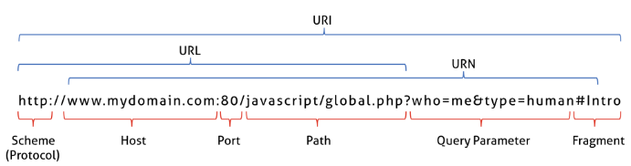

# 21장. 빌트인 객체

### 21.1 자바스크립트 객체의 분류

- 표준 빌트인 객체(Standard built-in objects/ native objects/ global objects)

  표준 빌트인 객체는 ECMAScript 사양에 정의된 객체를 말하며, 애플리케이션 전역의 공통 기능을 제공한다. 자바스크립트 실행 환경(브라우저 또는 Node.js 환경)과 관계없이 언제나 사용할 수 있고, 전역 객체의 프로퍼티로서 제공된다. 따라서 별도의 선언 없이 전역 변수처럼 언제나 참조할 수 있다.

- 호스트 객체(host objects)

  호스트 객체는 ECMAScript 사양에 정의되어 있지 않지만 자바스크립트 실행 환경(브라우저 또는 Node.js 환경)에서 추가로 제공하는 객체를 말한다. 브라우저 환경에서는 DOM, BOM, Canvas, XMLHttpRequest, fetch, requestAnimationFrame, SVG, Web Storage, Web Component, Web Worker와 같은 클리아언트 사이트 Web API를 호스트 객체로제공되고, Node.js 환경에서는 Node.js 고유의 API를 호스트 객체로 제공된다.

- 사용자 정의 객체(user-defined objects)

  사용자 정의 객체는 표준 빌트인 객체와 호스트 객체처럼 기본 제공되는 객체가 아닌 사용자가 직접 정의한 객체를 말한다.


### 21.2 표준 빌트인 객체

자바스크립트는 Object, String, Number, Boolean, Symbol, Date, Math, RegExp, Array, Map/Set, WeakMap/WeakSet, Function,Promise,  Reflect, Proxy, JSON, Error 등 40여 개의 표준 빌트친 객체를 제공한다.

Math, Reflect, JSON을 제외한 표준 빌트인 객체는 모두 인스턴스를 생성할 수 있는 생성자 함수 객체다. 생성자 함수 객체인 표준 빌트인 객체는 프로토타입 메서드와 정적 메서드를 제공하고 생성자 함수 객체가 아닌 표준 빌트인 객체는 정적 메서드만 제공한다.

생성자 함수인 표준 빌트인 객체가 생성한 인스턴스의 프로토타입은 표준 빌트인 객체의 prototype 프로퍼티에 바인딩된 객체다.

```javascript
// String 생성자 함수에 의한 String 객체 생성
const strObj = new String('Lee'); // String {"Lee"}

// String 생성자 함수를 통해 생성한 strObj 객체의 프로토타입은 String.prototype이다.
console.log(Object.getPrototypeOf(strObj) === String.prototype); // true
```


### 21.3 원시값과 래퍼 객체

문자열이나 숫자, 불리언 등의 원시값이 있는데도 문자열, 숫자, 불리언 객체를 생성하는 String, Number, Boolean 등의 표준 빌트인 생성자 함수가 존재하는 이유는 무엇일까?

원시값은 객체가 아니므로 프로퍼티나 메서드를 가질 수 없는데도 원시값인 문자열이 마치 객체처럼 동작한다.

```javascript
const str = 'hello';

// 원시 타입인 문자열이 프로퍼티와 메서드를 갖고 있는 객체처럼 동작한다.
console.log(str.length); // 5
console.log(str.toUpperCase()); // HELLO
```

이게 가능한 이유는 원시값을 객체처럼 사용하면 자바스크립트 엔진은 암묵적으로 연결된 객체를 생성하여 생성된 객체로 프로퍼티에 접근하거나 메서드를 호출하고 다시 원시값으로 되돌린다.

이때, 생성되는 임시 객체 즉, **문자열, 숫자, 불리언 값에 대해 객체처럼 접근하면 생성되는 임시 객를 래퍼 객체**라고 한다. 

암묵적으로 래퍼 객체를 생성하고 다시 원시값으로 돌아오는 일련의 과정들을 다음의 코드로 자세하게 살펴보자.

```javascript
// 1. 식별자 str은 문자열을 값으로 가지고 있다.
const str = 'hello'; 

// 2. 식별자 str은 암묵적으로 생성된 래퍼 객체를 가리킨다.
// 식별자 str의 값 'hello'는 래퍼 객체의 [[StringData]] 내부 슬롯에 할당된다.
// 래퍼 객체에 name 프로퍼티가 동적 추가된다.
str.name = 'Lee';

// 3. 식별자 str은 다시 원래의 문자열, 즉 래퍼 객체의 [[StringData]] 내부 슬롯에 할당된 원시값을 갖는다.
// 이때 2번에서 생성된 래퍼 객체는 아무도 참조하지 않는 상태이므로 가비지 컬렉션의 대상이 된다.

// 4. 식별자 str은 새롭게 암묵적으로 생성된(2번에서 생성된 래퍼 객체와는 다른) 래퍼 객체를 가리킨다.
// 새롭게 생성된 래퍼 객체에는 name 프로퍼티가 존재하지 않는다.
console.log(str.name); // undefined

// 5. 식별자 str은 다시 원래의 문자열, 즉 래퍼 객체의 [[StringData]] 내부 슬롯에 할당된 원시값을 갖는다.
// 이때 4번에서 생성된 래퍼객체는 아무도 참조하지 않는 상태이므로 가비지 컬렉션의 대상이 된다.
console.log(typeof str, str); // string hello
```


### 21.4  전역 객체

전역 객체는 코드가 실행되기 이전 단계에 자바스크립트 엔진에 의해 어떤 객체보다도 먼저 생성되는 특수한 객체이며, 어떤 객체에도 속하지 않은 최상위 객체다.

전역 객체는 자바스크립트 환경에 따라 지칭하는 이름이 다르다. 브라우저 환경에서는  window(또는 self, this, frames)가 전역 객체를 가리키지만 Node.js 환경에서는 global이 전역 객체를 가리킨다.

전역 객체는 계층적 구조상 어떤 객체에도 속하지 않은 모든 빌트인 객체(표준 빌트인 객체와 호스트 객체)의 최상위 객체다. 전역 객체 자신은 어떤 객체의 프로퍼티도 아니며 객체의 계층적 구조상 표준 빌트인 객체와 호스트 객체를 프로퍼티로 소유한다는 것을 말한다.

전역 객체의 특징을 알아보자.

- 전역 객체는 개발자가 의도적으로 생성할 수 없다. 즉, 전역 객체를 생성할 수 있는 생성자 함수가 제공되지 않는다.

- 전역 객체의 프로퍼티를 참조할 때 window(또는 global)를 생략할 수 있다.

  ```javascript
  // 문자열 'F'를 16진수로 해석하여 10진수로 변환하여 반환한다.
  window.parseInt('F', 16); // 15
  // window.parseInt는 parseInt로 호출할 수 있다.
  parseInt('F', 16); // 15
  
  window.parseInt === parseInt; // true
  ```

- 전역 객체는 모든 표준 빌트인 객체를 프로퍼티로 가지고 있다.

- 자바스크립트 실행 환경에 따라 추가적으로 프로퍼티와 메서드를 갖는다.

- var 키워드로 선언한 전역 변수와 선언하지 않은 변수에 값을 할당한 암묵적 전역, 그리고 전역 함수는 전역 객체의 프로퍼티가 된다.

  ```javascript
  // var 키워드로 선언한 전역 변수
  var foo = 1;
  console.log(window.foo); // 1
  
  // 선언하지 않은 변수에 값을 암묵적 전역. bar는 전역 변수가 아니라 전역 객체의 프로퍼티다.
  bar = 2; // window.bar = 2
  console.log(window.bar); // 2
  
  // 전역 함수
  function baz() { return 3; }
  console.log(window.baz()); // 3
  ```

- let이나 const 키워드로 선언한 전역 변수는 전역 객체의 프로퍼티가 아니다. 즉, window.foo와 같이 접근할 수 없다. let이나 const 키워드로 선언한 전역 변수는 보이지 않는 개념적인 블록(전역 렉시컬 환경의 선언적 환경 레코드) 내에 존재하게 된다.

  ```javascript
  let foo = 123;
  console.log(window.foo); // undefined
  ```

- 브라우저 환경의 모든 자바스크립트 코드는 하나의 전역 객체 window를 공유한다. 여러 개의 script 태그를 통해 자바스크립트 코드를 분리해도 하나의 전역 객체 window를 공유하는 것은 변함이 없다. 이는 분리되어 있는 자바스크립트 코드가 하나의 전역을 공유한다는 의미이다.

#### **[빌트인 전역 프로퍼티]**

빌트인 전역 프로퍼티는 전역 객체의 프로퍼티를 의미한다. 주로 애플리케이션 전역에서 사용하는 값을 제공한다.

##### < Infinity >

Infinity 프로퍼티는 무한대를 나타내는 숫자값 Infinity를 갖는다.

```javascript
// 전역 프로퍼티는 window를 생략하고 참조할 수 있다.
console.log(window.Infinity === Infinity); // true

// 양의 무한대
console.log(3/0); // Infinity
// 음의 무한대
console.log(-3/0); // -Infinity
// Infinity는 숫자값이다.
console.log(typeof Infinity); // number
```

##### **< NaN >**

NaN 프로퍼티는 숫자가 아님을 나타내는 숫자값 NaN을 갖는다. NaN 프로퍼티는 Number.NaN 프로퍼티와 같다.

```javascript
console.log(window.NaN); // NaN
console.log(Number('xyz')); // NaN
console.log(1 * 'string'); // NaN
console.log(typeof NaN); // number
```

##### **< undefined >**

undefined 프로퍼티는 원시 타입 undefined를 값으로 갖는다.

```javascript
console.log(window.undefined); // undefined
var foo;
console.log(foo); // undefined
console.log(typeof undefined); // undefined
```

#### **[빌트인 전역 함수]**

빌트인 전역 함수는 애플리케이션 전역에서 호출할 수 있는 빌트인 함수로서 전역 객체의 메서드다.

##### **< eval >**

eval 함수는 자바스크립트 코드를 나타내는 문자열을 인수로 전달받는다. 전달받은 문자열 코드가 표현식이라면 eval 함수는 문자열 코드를 런타임에 평가하여 값을 생성하고, 전달받은 인수가 표현식이 아닌 문이라면 eval 함수는 문자열 코드를 런타임에 실행된다. 문자열 코드가 여러 개의 문으로 이루어져 있다면 모든 문을 실행한다.

```javascript
/**
* 주어진 문자열 코드를 런타임에 평가 또는 실행된다.
* @param {string} code - 코드를 나타내는 문자열
* @returns {*} 문자열 코드를 평가/실행한 결과값
*/
eval(code)
```

```javascript
// 표현식인 문
eval('1 + 2;'); // 3
// 표현식이 아닌 문
eval('var x = 5;') // undefined

// eval 함수에 의해 런타임에 변수 선언문이 실행되어 x 변수가 선언되었다.
console.log(x); // 5

// 객체 리터럴은 반드시 괄호로 둘러싼다.
const o = eval('({ a : 1 })');
console.log(o); // {a:1}

// 함수 리터럴은 반드시 괄호로 둘러싼다.
const f = eval('(function() { return 1; })');
console.log(f()); // 1

// 인수로 전달받은 문자열 코드가 여러 개의 문으로 이루어져 있다면 모든 문을 실행한 다음, 마지막 결과값을 반환한다.
eval('1 + 2; 3 + 4;'); // 7
```

**eval 함수는 기존의 스코프를 런타임에 동적으로 수정한다.** 

하지만 strict mode에서 eval함수는 기존의 스코프를 수정하지 않고 eval 함수 자신의 자체적인 스코프를 생성한다.

```javascript
const x = 1;
function foo() {
    'use strict';
    
    // strict mode에서 eval함수는 기존의 스코프를 수정하지 않고 eval 함수 자신의 자체적인 스코프를 생성한다.
    eval('var x = 2; console.log(x);'); // 2
    console.log(x); // 1
}
foo();
console.log(x); // 1
```

인수로 전달받은 문자열 코드가 let, const 키워드를 사용한 변수 선언문이라면 암묵적으로  strict mode가 적용된다.

eval 함수를 통해 사용자로부터 입력받은 콘텐츠를 실행하는 것은 보안에 매우 취약하다. 또한 eval 함수를 통해 실행되는 코드는 자바스크립트 엔진에 의해 최적화가 수행되지 않기때문에 일반 코드보다 실행속도가 느리다. 따라서 **eval 함수 사용은 금지해야 한다.**

##### **< isFinite >**

전달받은 인수가 정상적인 유한수인지 검사하여 유한수이면 true를 반환하고, 무한수이면 false를 반환한다. 전달받은 인수의 타입이 숫자가 아닌 경우에는 숫자로 타입을 변환한 후 검사를 수행한다. 이 때 인수가 NaN으로 평가되는 값이라면 false를 반환한다.

```javascript
/**
* 전달받은 인수가 유한수인지 확인하고 그 결과를 반환한다.
* @param {number} testValue - 검사 대상 값
* @returns {boolean} 유한수 여부 확인 결과
*/
inFinite(testValue)
```

isFinite(null)은 true를 반환한다. null을 숫자 타입으로 변환하면 0이 되기 때문이다.

##### **< isNaN >**

전달받은 인수가 NaN인지 검사하여 그 결과를 불리언 타입으로 반환한다. 전달받은 인수의 타입이 숫자가 아닌 경우 숫자로 타입을 변환한 후 검사를 수행한다.

```javascript
/**
* 주어진 숫자가 NaN인지 확인하고 그 결과를 반환한다.
* @param {number} testValue - 검사 대상 값
* @returns {boolean} NaN 여부 확인 결과
*/
isNaN(testValue)
```

##### **< parseFloat >**

전달받은 문자열 인수를 부동 소숫점 숫자, 즉 실수로 해석하여 반환한다. 공백으로 구분된 문자열은 첫 번째 문자열만 반환한다. 첫 번재 문자열을 숫자로 변환할 수 없다면 NaN을 반환한다.

```javascript
/**
* 전달받은 문자열 인수를 실수로 해석하여 반환한다.
* @param {string} string - 변환 대상 값
* @returns {number} 변환 결과
*/
parseFloat(string)
```

##### **< parseInt >**

전달받은 문자열 인수를 정수로 해석하여 반환한다.

```javascript
/**
* 전달받은 문자열 인수를 정수로 해석하여 반환한다.
* @param {string} string - 변환 대상 값
* @param {number} [radix] - 진법을 나타내는 기수(2 ~ 36, 기본값 10)
* @ returns {number} 변환 결과
*/
parseInt(string, radix);
```

```javascript
// '10'을 10진수로 해석하고 그 결과를 10진수 정수로 반환한다.
parseInt('10'); // 10
// '10'을 2신수로 해석하고 그 결과를 10진수 정수로 반환한다.
parseInt('10', 2); // 2

// 기수를 지정하여 10진수 숫자를 해당 기수의 문자열로 변환하여 반환하고 싶을 때는 Number.prototype.toString 메서드 사용
const x = 15;

// 10진수 15를 2진수로 변환하여 그 결과를 문자열로 반환한다.
x.toString(2); // '1111'
// 문자열 '1111'을 2진수로 해석하고 그 결과를 10진수 정수로 반환한다.
parseInt(x.toString(2), 2); // 15
```

##### **< encodeURI / decodeURI >**

encodeURI 함수는 완전한 URI를 문자열로 전달받아 이스케이프 처리를 위해 인코딩한다. URI는 인터넷에 있는 자원을 나타내는 유일한 주소를 말한다. URI의 하위개념으로 URL, URN이 있다.



```javascript
/**
* 완전한 URI를 문자열로 전달받아 이스케이프 처리를 위해 인코딩한다.
* @param {string} uri - 완전한 URI
* @returns {string} 인코딩된 URI
*/
encodeURI(uri)
```

여기서 이스케이프 처리란 네트워크를 통해 정보를 공유할 때 어떤 시스템에서도 읽을 수 있는 아스키 문자 셋으로 변환하는 것이다.

```javascript
/**
* 인코딩된 URI를 전달받아 이스케이프 처리 이전으로 디코딩된다.
* @param {string} encodedURI - 인코딩된 URI
* @returns {string} 디코딩된 URI
*/
decodeURI(encodedURI)
```

##### **< endoceURIComponent / decodeURIComponent >**

endoceURIComponent 함수는 URI 구성 요소를 인수로 전달받아 인코딩한다.

```javascript
/**
* URI의 구성요소를 전달받아 이스케이프 처리를 위해 인코딩한다.
* @param {string} uriComponent - URI의 구성요소
* @returns {string} 인코딩된 URI의 구성요소
*/
encodeURIComponent(uriComponent)

/**
* 인코딩된 URI의 구성요소를 전달받아 이스케이프 처리 이전을 위해 인코딩한다.
* @param {string} encodedURIComponent - 인코딩된 URI의 구성요소
* @returns {string} 디코딩된 URI의 구성요소
*/
deodeURIComponent(encodedURIComponent)
```

encodeURIComponent 함수는 인수로 전달된 문자열을 URI의 구성요소인 쿼리 스트링의 일부로 간주한다. 따라서 쿼리 스트링 구분자로 사용되는 =, ?, &까지 인코딩한다.

반면 encodeURI 함수는 매개변수로 전달된 문자열을 완전한 URI 전체라고 간주한다. 따라서 쿼리 스트링 구분자로 사용되는 =, ?, &은 인코딩하지 않는다.

#### **[암묵적 전역]**

```javascript
var x = 10; // 전역 변수

function foo() {
    // 선언하지 않은 식별자에 값을 할당
    y = 20; // widnow.y = 20;
}
foo();

// 선언하지 않은 식별자 y를 전역에서 참조할 수 있다.
console.log(x + y); // 30
```

foo 함수 내의 y는 선언하지 않은 식별자다. 참조 에러가 발생할 것 처럼 보이지만 식별자 y는 마치 선언된 전역 변수처럼 동작한다. 이는 자바스크립트 엔진이 y = 20을 window.y = 20으로 해석하여 전역 객체에 프로퍼티를 동적 생성한다. 결국 y는 전역 객체의 프로퍼티가 되어 마치 전역 변수처럼 동작한다. 이러한 현상을 **암묵적 전역**이라 한다.

하지만 y는 변수 선언 없이 단지 전역 객체의 프로퍼티로 추가되었을 뿐이라 변수 호이스팅이 발생하지 않는다.

```javascript
// 전역 변수 x는 호이스팅이 발생한다.
console.log(x); // undefined
// 전역 변수가 아니라 단지 전역 객체의 프로퍼티인 y는 호이스팅이 발생하지 않는다.
console.log(y); // ReferenceError : y is not defined

var x = 10; // 전역 변수
function foo() {
    // 선언하지 않은 식별자에 값을 할당
    y = 20; // window.y = 20;
}
foo();

// 선언하지 않은 식별자 y를 전역에서 참조할 수 있다.
console.log(x + y); // 30
```

또한 y는 delete 연산자로 삭제할 수 있다. 원래 전역 변수는 프로퍼티이지만 delete 연산자로 삭제할 수 없다.

```javascript
var x = 10; // 전역 변수
function foo() {
    // 선언하지 않은 식별자에 값을 할당
    y = 20; // window.y = 20;
    console.log(x + y);
}
foo(); // 30

console.log(window.x); // 10
console.log(window.y); // 20

delete x; // 전역 변수는 삭제 되지 않는다.
delete y; // 프로퍼티는 삭제된다.

console.log(window.x); // 10
console.log(window.y); // undefined
```

