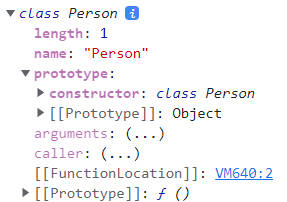
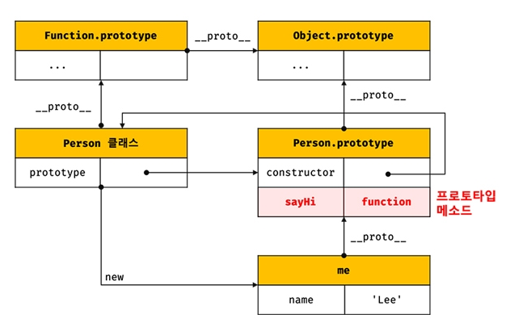
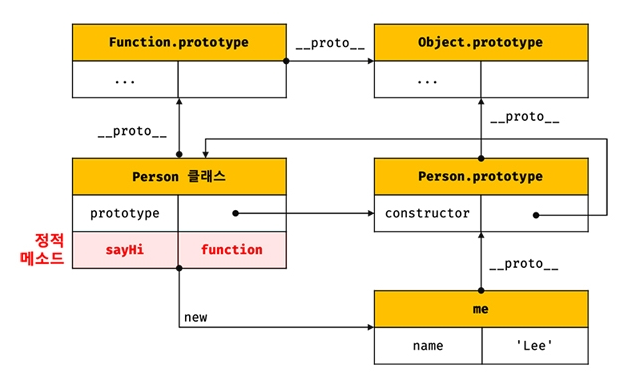

# 25장. 클래스(1)

### 25.1 클래스는 프로토타입의 문법적 설탕인가?

자바스크립트는 프로토타입 기반 객체 지향 언어이다. 프로토타입 기반 객체지향 언어는 클래스가 필요 없는 객체 지향 프로그래밍 언어다. 하지만 기존 클래스 기반 언어에 익숙한 프로그래머들에게는 프로토타입 기반 방식에 혼란을 느끼고 자바스크립트를 어렵게 느끼게 하는 하나의 장벽처럼 인식되었다.

그래서 ES6부터 클래스가 도입되었는데, 기존의 프로토타입 기반 객체지향 모델을 없애고 클래스 기반 객체지향을 제공하는게 아니라 클래스 기반 객체 지향 프로그래밍 언어와 매우 흡사한 새로운 객체 생성 메커니즘을 제시한다.

클래스는 생성자 함수와 매우 유사하게 동작하지만 몇 가지 차이가 있다.

1. 클래스를 new 연산자 없이 호출하면 에러가 발생한다. 하지만 생성자 함수를 new 연산자 없이 호출하면 일반 함수로서 호출된다.
2. 클래스는 상속을 지원하는 extends와 super 키워드를 제공한다. 하지만 생성자 함수는 제공하지 않는다.
3. 클래스는 호이스팅이 발생하지 않는 것처럼 동작한다. 
4. 클래스 내의 모든 코드에는 암묵적으로 strick mode가 지정되어 실행되며 이를 해제할 수 없다.
5. 클래스의 constructor, 프로토타입 메서드, 정적 메서드는 모두 프로퍼티 어트리뷰트 [[Enumerable]]의 값이 false다. 다시 말해, 열거되지 않는다.

### 25.2 클래스 정의

클래스는 class 키워드를 사용하여 정의한다. 일반적으로 파스칼 케이스를 사용한다.

클래스를 표현식으로 정의할 수 있는데, 이는 클래스가 값으로 사용할 수 있는 일급 객체라는 것을 의미한다. 즉, 클래스는 일급 객체로서 다음과 같은 특징을 갖는다.

- 무명의 리터럴로 생성할 수 있다. 즉, 런타임에 생성이 가능하다.
- 변수나 자료구조(객체, 배열 등)에 저장할 수 있다.
- 함수의 매개변수에게 전달할 수 있다.
- 함수의 반환값으로 사용할 수 있다.

클래스 몸체에는 0개 이상의 메서드만 정의할 수 있다. 클래스 몸체에서 정의할 수 있는 메서드는 constructor(생성자), 프로토타입 메서드, 정적 메서드의 3가지가 있다.

```javascript
class Person {
    // 생성자
    constructor(name) {
        // 인스턴스 생성 및 초기화
        this.name = name; // name 프로퍼티는 public하다.
    }
    // 프로토타입 메서드
    sayHi() {
        console.log(`Hi! My name is ${this.name}`);
    }
    // 정적 메서드
    static sayHello() {
        console.log('Hello!')
    }
}
// 인스턴스 생성
const me = new Person('Lee');
// 인스턴스의 프로퍼티 참조
console.log(me.name); // Lee
//프로토타입 메서드 호출
me.sayHi(); // Hi! My name is Lee
// 정적 메서드 호출
Person.sayHello(); // Hello!
```


### 25.3 클래스 호이스팅

클래스는 함수로 평가된다. 클래스 선언문으로 정의한 클래스는 함수 선언문과 같이 런타임 이전에 먼저 평가되어 함수 객체를 생성한다. 하지만 클래스는 let이나 const로 선언한 것과 마찬가지로 클래스 정의 이전에 참조할 수 없다. 호이스팅이 발생하지 않는 것처럼 보이지만 실제로는 호이스팅이 되는 것이다.


### 25.4 인스턴스 생성

클래스는 생성자 함수이며 new 연산자와 함께 호출되어 인스턴스를 생성한다.  인스턴스를 생성하는 것이 클래스의 유일한 존재 이유여서 반드시 new 연산자와 함께 호출해야 한다.

```javascript
class Person {}
// 인스턴스 생성
const me = new Person();
console.log(me); // Person()
```


### 25.5 메서드

클래스 몸체에는 0개 이상의 메서드만 선언할 수 있다. 클래스 몸체에서 정의할 수 있는 메서드는 constructor(생성자), 프로토타입 메서드, 정적 메서드 3가지가 있다.

#### **[ constructor ]**

constructor는 인스턴스를 생성하고 초기화하기 위한 특수한 메서드다. constructor는 이름을 변경할 수 없다.

```javascript
class Person {
    // 생성자
    constructor(name) {
        // 인스턴스 생성 및 초기화
        this.name = name;
    }
}
console.dir(Person);
```



위의 코드를 브라우저의 개발자 도구에서 실행했을 때의 출력값이다. 보면 모든 함수 객체가 가지고 있는 prototype 프로퍼티가 가리키는 프로토타입 객체의 constructor 프로퍼티는 클래스 자신을 가리키고 있다. 이는 클래스가 인스턴스를 생성하는 생성자 함수라는 것을 의미한다.

여기서 주의해야 할 점은 클래스의 constructor 메서드와 프로토타입의 constructor 프로퍼티는 이름이 같아 혼동하기 쉽지만 직접적인 관련이 없다. 프로토타입의 constructor 프로퍼티는 모든 프로토타입이 가지고 있는 프로퍼티이며 생성자 함수를 가리킨다.

constructor는 생성자 함수와 비슷하지만 몇가지 차이점이 있다.

-  constructor는 클래스 내에 최대 한 개만 존재할 수 있다. 2개 이상이면 오류가 발생한다.
- constructor는 생략할 수 있다. 만약 생략하면 클래스에 빈 constructor가 암묵적으로 정의된다. 하지만 인스턴스를 초기화하려면 constructor를 생략해서는 안된다.
- constructor는 별도의 반환문을 갖지 않는다. 클래스가 호출되면 생성자 함수와 동일하게 암묵적으로 this, 즉 인스턴스를 반환하기 때문이다.

#### **[ 프로토타입 메서드 ]**

생성자 함수를 사용하여 인스턴스를 생성하는 경우 프로토타입 메서드를 생성하기 위해서는 명시적으로 프로토타입에 메서드를 추가해야 한다. 하지만 클래스 몸체에서 정의한 메서드는 클래스의 prototype 프로퍼티에 메서드를 추가하지 않아도 기본적으로 프로토타입 메서드가 된다.

```javascript
// 생성자 함수
class Person {
    constructor(name) {
     	this.name = name;   
    }
}
// 프로토타입 메서드(생성자 함수)
Person.prototype.sayHi = function () {
    console.log(`Hi! My name is ${this.name}`);
}
// 프로토타입 메서드(클래스)
sayHi() {
    console.log(`Hi! My name is ${this.name}`);
};
const me = new Person('Lee');
me.sayHi(); // Hi! My name is Lee
```

클래스로 생성한 인스턴스의 프로토타입 체인



#### **[ 정적 메서드 ]**

정적 메서드는 인스턴스를 생성하지 않더라도 호출할 수 있는 메서드를 말한다. 

생성자 함수의 경우 정적 메서드를 생성하기 위해서는 명시적으로 생성자 함수에 메서드를 추가해야 한다. 하지만 클래스에서는 메서드에 static 키워드를 붙이면 정적 메서드(클래스 메서드)가 된다.

```javascript
class person {
    constructor(name) {
        this.name = name;
    }
}
// 정적 메서드 (생성자 함수)
Person.sayHi = function () {
    console.log('Hi!');
}
// 정적 메서드 호출
Person.sayHi();

// 정적 메서드(클래스)
static sayHi() {
    console.log('Hi!');
}
```

정적 메서드 프로토타입 체인



위에서 볼 수 있다시피 정적 메서드는 클래스에 바인딩된 메서드가 된다. 클래스는 클래스 정의가 평가되는 시점에 함수 객체가 되므로 인스턴스와 달리 별다른 생성 과정이 필요 없다. 따라서 정적 메서드는 클래스 정의 이후 인스턴스를 생성하지 않아도 호출할 수 있다.

정적 메서드는 프로토타입 메서드처럼 인스턴스로 호출할 수 없고 클래스로 호출한다. 정적 메서드가 바인딩된 클래스는 인스턴스의 프로토타입 체인상에 존재하지 않아서 인스턴스로 클래스의 메서드를 상속받을 수 없다.

#### **[ 정적 메서드와 프로토타입 메서드의 차이 ]**

정적 메서드와 프로토타입 메서드의 차이는 다음과 같다.

1. 정적 메서드와 프로토타입 메서드는 자신이 속해 있는 프로토타입 체인이 다르다.
2. 정적 메서드는 클래스로 호출하고 프로토타입 메서드는 인스턴스로 호출한다.
3. 정적 메서드는 인스턴스 프로퍼티를 참조할 수 없지만 프로토타입 메서드는 인스턴스 프로퍼티를 참조할 수 있다.

프로토타입 메서드와 정적 메서드 내부의 this 바인딩이 다르다. 따라서 메서드 내부에서 인스턴스 프로퍼티를 참조할 필요가 있다면 this를 사용해야 하며, 이런 경우에는 프로토타입 메서드로 정의해야 한다. 하지만 메서드 내부에서 인스턴스 프로퍼티는 참조해야 할 필요가 없다면 this를 사용하지 않게 된다.

#### **[ 클래스에서 정의한 메서드의 특징 ]**

1. function 키워드를 생략한 메서드 축약 표현을 사용한다.
2. 객체 리터럴과는 다르게 클래스에 메서드를 정의할 때는 콤마가 필요 없다.
3. 암묵적으로 strick mode로 실행된다.
4. for ... in 문이나 Object.keys 메서드 등으로 열거할 수 없다. 즉, 프로퍼티의 열거 가능 여부를 나타내며, 불리어 값을 갖는 프로퍼티 어트리뷰트 [[ Enumerable ]]의 값이 false다.
5. 내부 메서드 [[ Constructor ]]를 갖지 않는 non-contructor다. 따라서 new 연산자와 함께 호출할 수 없다.


### 25.6 클래스의 인스턴스 생성 과정

new 연산자와 함께 클래스를 호출하면 생성자 함수와 마찬가지로 클래스의 내부 메서드 [[Construct]]가 호출된다. 클래스는 new 연산자 없이 호출할 수 없다. 

인스턴스 생성 과정은 다음과 같다.

1. 인스턴스 생성과 this 바인딩

   new 연산자와 함께 클래스를 호출하면 constructor의 내부 코드가 실행되기에 앞서 암묵적으로 빈 객체가 생성된다. 이 빈 객체가 아직 완성되지는 않았지만 클래스가 생성된 인스턴스다. 이때 클래스가 생성한 인스턴스의 프로토타입으로 클래스의 prototype 프로퍼티가 가리키는 객체가 설정된다. 이 인스턴스는 this에 바인딩된다. 따라서 constructor 내부의 this는 클래스가 생성한 인스턴스를 가리킨다.

2. 인스턴스 초기화

   this에 바인딩되어 있는 인스턴스에 프로퍼티를 추가하고 constructor가 인수로 전달받은 초기값으로 인스턴스의 프로퍼티 값을 초기화한다. 

3. 인스턴스 반환

   클래스의 모든 처리가 끝나면 완성된 인스턴스가 바인딩된 this가 암묵적으로 반환된다.

   ```javascript
   class Person{
       // 생성자
       constructor(name) {
           // 1. 암묵적으로 인스턴스가 생성되고 this에 바인딩된다.
           console.log(this); // Person {}
           console.log(Object.getPrototypeOf(this) === Person.prototype); // true
           
           // 2. this에 바인딩되어 있는 인스턴스를 초기화한다.
           this.name = name;
           
           // 3. 완성된 인스턴스가 바인딩된 this가 암묵적으로 반환된다.
       }
   }
   ```

   

### 25.7 프로퍼티

**[ 인스턴스 프로퍼티 ]**

인스턴스 프로퍼티는 constructor 내부에서 정의해야 한다.

```javascript
class Person {
    constructor(name) {
        this.name = name;
    }
}
const me = new Person('Lee');
console.log(me); // Person {name: "Lee"}
```

ES6의 클래스는 다른 객체 지향 언어처럼 private, public, protected 키워드와 같은 접근 제한자를 지원하지 않는다. 따라서 인스턴스 프로퍼티는 언제나 public하다.

**[ 접근자 프로퍼티 ]**

접근자 프로퍼티는 자체적으로 값([[Value]] 내부 슬롯)을 갖지 않고 다른 데이터 프로퍼티의 값을 읽거나 저장할 때 사용하는 접근자 함수로 구성된 프로퍼티다. 접근자 프로퍼티는 클래스에서도 사용할 수 있다.

```javascript
class Person {
    constructor(firstName, lastName) {
        this.firstName = firstName;
        this.lastName = lastName;
    }
    // fullName은 접근자 함수로 구성된 접근자 프로퍼티다.
    // getter 함수
    get fullName() {
        return `${this.firstName} ${this.lastName}`;
    }
    // setter 함수
    set fullName(name) {
        [this.firstName, this.lastName] = name.split(' ');
    }
}
const me = new Person('Ungmo', 'Lee');

// 데이터 프로퍼티를 통한 프로퍼티 값의 참조.
console.log(`${me.firstName} ${me.lastName}`); // Ungmo Lee

// 접근자 프로퍼티를 통한 프로퍼티 값의 저장
// 접근자 프로퍼티 fullName에 값을 저장하면 setter 함수가 호출된다.
me.fullName = 'Heegun Lee';
console.log(me); // {firstName: "Heegun", lastName: "Lee"}

// 접근자 프로퍼티를 통한 프로퍼티 값의 참조
// 접근자 프로퍼티 fullName에 접근하면 getter 함수가 호출된다.
console.log(me.fullName); // Heegun Lee

// fullName은 접근자 프로퍼티다.
// 접근자 프로퍼티는 get, set, enumerable, configurable 프로퍼티 어트리뷰트를 갖는다.
```

getter는 인스턴스 프로퍼티에 **접근**할 때마다 프로퍼티 값을 조작하거나 별도의 행위가 필요할 때 사용한다. getter는 메서드 이름 앞에 get 키워드를 사용해 정의한다.

setter는 인스턴스 프로퍼티에 **값을 할당**할 때마다 프로퍼티 값을 조작하거나 별도의 행위가 필요할 때 사용한다. setter는 메서드 이름 앞에 set 키워드를 사용해 정의한다.

getter는 호출하는 것이 아니라 프로퍼티처럼 참조하는 형식으로 사용하며, setter도 호출하는 것이 아니라 값을 할당하는 형식으로 사용한다.

getter는 무언가를 취득할 때 사용하므로 반드시 무언가를 반환해야 하고 setter는 무언가를 프로퍼티에 할당할 때 사용하므로 반드시 매개변수가 있어야 한다. setter는 단 하나의 값만 할당받기 때문에 단 하나의 매개변수만 선언할 수 있다.


**[ 클래스 필드 정의 제안 ]**

클래스 필드는 클래스 기반 객체지향 언어에서 클래스가 생성할 인스턴스의 프로퍼티르르 가리키는 용어다. 

클래스 몸체에서 클래스 필드를 정의할 수 있는 클래스 필드 정의 제안은 아직 ECMAScript의 정식 표준 사양으로 승급되지 않았다. 하지만 최신 브라우저(Chrome 72 이상)과 Node.js(버전 12 이상)은 승급이 확실시되는 이 제안을 선제적으로 미리 구현해놓았다.

클래스 필드 정의 제안 알아둘 점

1. 클래스 몸체에서 클래스 필드를 정의하는 경우 this에 클래스 필드를 바인딩해서는 안된다. this는 클래스의 constructor와 메서드 내에서만 유효하다.

   ```javascript
   class Person {
       // this에 클래스 필드를 바인딩해서는 안된다.
       this.name = ''; // SyntaxError : Unexpected token '.'
   }
   ```

2. 클래스 필드를 참조할 경우 this를 반드시 사용해야 한다.

   ```javascript
   class Person {
       name = 'Lee';
       
       constructor() {
           console.log(name); // ReferenceError : name is not defined
       }
   }
   new Person();
   ```

3. 클래스 필드에 초기값을 할당하지 않으면 undefined를 갖는다.

   ```javascript
   class Person {
       name;
   }
   const me = new Person();
   console.log(me); // Person {name: undefined}
   ```

4. 인스턴스를 생성할 때 외부의 초기값으로 클래스 필드를 초기화해야 할 필요가 있다면 constructor에서 클래스 필드를 초기화해야 한다.

   ```javascript
   class Person {
       name;
       
       constructor(name) {
           this.name = name;
       }
   }
   const me = new Person('Lee');
   console.log(me); // Person {name: 'Lee'}
   ```

5. 함수는 일급 객체이므로 함수를 클래스 필드에 할당할 수 있다. 메서드를 정의할 수도 있다. 하지만 모든 클래스 필드는 인스턴스 프로퍼티가 되므로 이 함수는 프로토타입 메서드가 아니라 인스턴스 메서드가 된다. 따라서 클래스 필드에 함수를 할당하는 것은 권장하지 않는다.

클래스 필드 정의 제안으로 인해 인스턴스 프로퍼티를 정의하는 방식은 두 가지가 되었다. 인스턴스를 생성할 때외부 초기값으로 클래스 필드를 초기화할 필요가  있다면 constructor에서 인스턴스 프로퍼티를 정의하는 기존 방식을 사용하고, 인스턴스를 사용할 때 외부 초기값으로 클래스 필드를 초기화할 필요가 없다면 기존의 constructor에서 인스턴스 프로퍼티를 정의하는 방식과 클래스 필드 정의 제안 모두 사용할 수 있다.


**[ private 필드 정의 제안 ]**

자바스크립트는 캡슐화를 완전하게 지원하지도 않고, 접근 제한자를 지원하지도 않는다. 따라서 인스턴스 프로퍼티는 인스턴스를 통해 클래스 외부에서 언제나 참조할 수 있다.(항상 public)

다행히도 private 필드를 정의할 수 있는 새로운 사양이 제안되어 있고, 표준 사양으로 승급이 확실시되는 이 제안도 최신 브라우저와 최신 Node.js에 이미 구현되어 있다.

방법을 자세히 알아보자.

private 필드의 선두에는 #을 붙여준다. private 필드를 참조할 때도 #을 붙여주어야 한다.

```javascript
class Person {
    // private 필드 정의
    #name = '';
    
    constructor(name) {
        // private 필드 참조
        this.#name = name;
    }
}
const me = new Person('Lee');
// private 필드 #name은 클래스 외부에서 참조할 수 없다.
console.log(me.#name); // SyntaxError : Private field '#name' must be declared in an enclosing class
```

private 필드는 클래스 내부에서만 참조할 수 있다. 클래스 외부에서 private 필드에 직접 접근할 수 있는 방법은 없다. 하지만 접근자 프로퍼티를 통해 간접적으로 접근하는 방법은 유효하다.

```javascript
class Person{
    #name = '';
    
    constructor(name) {
        this.#name = name;
    }
    get name() {
        // private 필드를 참조하여 trim한 다음에 반환한다.
        return this.#name.trim();
    }
}
const me = new Person('Lee ');
console.log(me.name); // Lee
```

private 필드는 반드시 클래스 몸체에 정의되어야 한다. private 필드를 직접 constructor에 정의하면 에러가 발생한다.


**[ static 필드 정의 제안 ]**

클래스에는 static 키워드를 사용하여 정적 메서드를 정의할 수 있다. 하지만 static 키워드를 사용하여 정적 필드를 정의할 수는 없다. 하지만 static public 필드, static private 필드, static private 메서드를 정의할 수 있는 새로운 표준 사양인 "Static class features"가 TC39 프로세스의 stage 3(candidate)에 제안되어 있다. 이 제안 중 static public/private 필드는 최신 브라우저와  최신 Node.js에 이미 구현되어 있다.

```javascript
class MyMath {
    // staic public 필드 정의
    static PI = 22 / 7;
    
    // static private 필드 정의
    static #num = 10;

	// static 메서드
	static increment() {
        return ++MyMath.#num;
    }
}
console.log(MyMath.PI); // 3.142857142857143
console.log(MyMath.increment()); // 11
```

