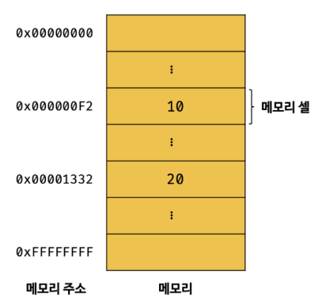
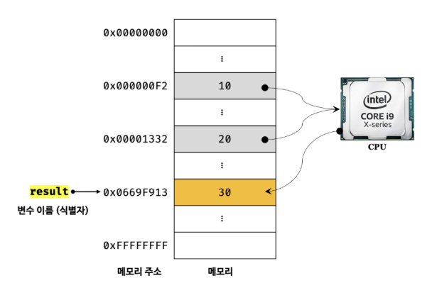
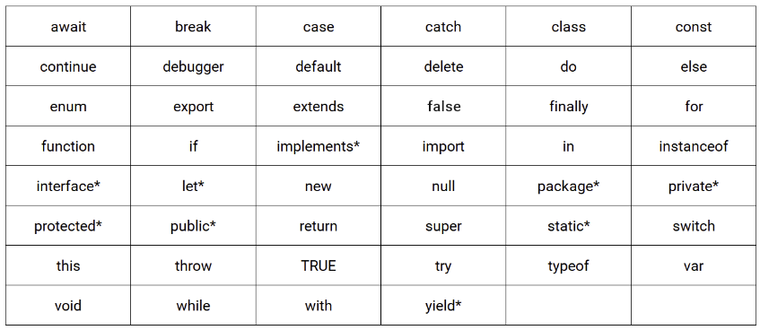

# 4장. 변수

#### 4.1 변수(variable)

컴퓨터는 CPU를 사용해 연산하고, 메모리를 사용해 데이터를 기억한다. 

메모리는 데이터를 저장할 수 있는 메모리 셀의 집합체다. 메모리 셀 하나의 크기는 1바이트이며, 컴퓨터는 1바이트 단위로 데이터를 저장하거나 읽어들인다. 각 셀은 고유의 메모리 주소를 갖는다. 이 메모리 주소는 메모리 공간의 위치를 나타낸다.



**하나의 값을 저장하기 위해 확보한 메모리 공간 자체 또는 그 메모리 공간을 식별하기 위해 붙인 이름**

```javascript
var result = 10 + 20;
```



위의 코드를 보면, 10 + 20은 연산을 통해 새로운 값 30을 생성한다. 

그리고 생성된 값 30은 메모리 공간에 저장된다. 

이 때 값 30을 다시 읽어 들여 재사용할 수 있도록 값이 저장된 메모리 공간에 상징적인 이름을 붙인 것이 **변수**.

메모리 공간에 저장된 값을 식별할 수 있는 고유한 이름(위의 예제에서는 result)를 **변수이름 또는 변수명**.

변수에 저장된 값(위의 예제에서는 30)을 **변수 값**.

변수에 값을 저장하는 것을 **할당(assignment), 대입, 저장**.

변수에 저장된 값을 읽어 들이는 것을 **참조(reference)**. 변수 이름을 통해 참조를 요청하면 자바스크립트 엔진은 변수 이름과 매핑된 메모리 주소를 통해 메모리 공간에 접근해서 저장된 값을 반환한다.


#### 4.2 식별자

**어떤 값을 구별해서 식별할 수 있는 고유한 이름**. 식별자는 값이 아니라 메모리 주소를 기억하고 있다. 

식별자는 네이밍 규칙을 준수해야 하며, 선언에 의해 자바스크립트 엔진에 식별자의 존재를 알린다.


#### 4.3 변수 선언

변수 선언은 변수를 생성하는 것을 말한다. 자세히 말하면, 값을 저장하기 위한 메모리 공간을 확보하고 변수 이름과 확보된 메모리 공간의 주소를 연결해서 값을 저장할 수 있게 준비하는 것이다.

변수를 사용하려면 반드시 선언이 필요하다. 변수를 선언할 때는 var, let, const 키워드를 사용한다.

**! 자바스크립의 독특한 특징 !**

**변수 선언한 후, 값을 할당하지 않아도 확보된 메모리 공간에는 자바스크립트 엔진에 의해  undefined라는 값이 암묵적으로 할당되어 초기화된다.** (여기서 말하는 초기화는 최초로 값을 할당하는 것을 말한다.)

var 키워드로 선언한 변수는 자동적으로 변수선언과 동시에 초기화가 이뤄지지만,  let과 const 변수는 선언만 해놓고 초기화는 하지 않는다. 코드 실행과정에서 변수 선언문을 만났을 때, 초기화를 수행한다.

선언하지 않은 식별자에 접근하면 ReferenceError(참조 에러)가 발생한다. 


#### 4.4 변수 선언의 실행 시점과 변수 호이스팅

```javascript
console.log(score); // undefined
var scroe; // 변수 선언문
```

위의 예제는 변수 선언문보다 변수를 참조하는 코드가 앞에 있다. 자바스크립트 코드는 인터프리터에 의해 한 줄씩 순차적으로 실행되어서 변수 선언문이 먼저 실행되는데 이때, score 변수의 선언이 실행되지 않아서 ReferenceError가 발생할 것 같지만 undefined가 출력이 되었다.

**그 이유는 var 키워드로 한 변수 선언은 소스코드가 한 줄씩 순차적으로 실행되는 시점, 즉 런타임이 아니라 그 이전 단계에서 먼저 실행되기 때문이다.**

즉, 변수 선언은 소스코드 어디에 있든 상관없이 다른 코드보다 먼저 실행된다. 

이처럼 **변수 선언문이 코드의 선두로 끌어 올려진 것처럼 동작하는 자바스크립트 고유의 특징을 변수 호이스팅**이라고 한다.


#### 4.5 값의 할당

변수에 값을 할당할 때는 할당 연산자 =을 사용한다. 할당 연산자는 우변의 값을 좌변의 변수에 할당한다.

자바 스크립트 엔진은 변수 선언과 값의 할당을 하나의 문으로 단축 표현해도 변수 선언과 값의 할당을 2개의 문으로 나누어 각각 실행한다. 이때, 주의해야 할 점은 변수 선언과 값의 할당의 실행 시점이 다르다는 것!

```javascript
var score = 80;
```

**변수 선언은 소스코드가 순차적으로 실행되는 시점인 런타임 이전에 먼저 실행되지만 값의 할당은 소스코드가 순차적으로 실행되는 시점인 런타임에 실행된다.**


#### 4.6 값의 재할당

재할당이란 이미 값이 할당되어 있는 변수에 새로운 값을 또다시 할당하는 것.

var 키워드로 선언한 변수는 값을 재할당할 수 있다. let도 재할당 가능 그러나 const는 불가.

재할당은 변수에 저장된 값을 다른 값으로 변경한다. 그래서 변수라고 한다.

**만약 값을 재할당할 수 없어서 변수에 저장된 값을 변경할 수 없다면 변수가 아니라 상수라 한다.**


#### 4.7 식별자 네이밍 규칙

- 식별자는 특수문자를 제외한 문자, 숫자, 언더스코어(_), 달러 기호($)를 포함할 수 있다.
- 단, 식별자는 특수문자를 제외한 문자, 언더스코어(_), 달러 기호($)로 시작해야 한다. 숫자로 시작하는 것은 허용하지 않는다.
- 예약어는 식별자로 사용할 수 없다. (예약어는 프로그래밍 언어에서 사용되고 있거나 사용될 예정인 단어를 말한다.)



```javascript
# 명명 규칙에 위배됨
var first-name;
var 1st;
var this;

# 대소문자를 구별함(다 다른 변수)
var firstname;
var firstName;
var FIRSTNAME;

# 변수는 존재 목적을 쉽게 이해하도록 의미를 명확히 표현해야 한다.
var x = 3; // x 변수가 의미하는 바를 알 수 없다.
var scroe = 100; // score 변수는 점수를 의미하니 좋은 변수 이름

```

네이밍 컨벤션은 하나 이상의 영어 단어로 구성된 식별자를 만들 때 가독성 좋게 단어를 한눈에 구분하기 위해 규정한 명명 규칙이다.

```javascript
// 카멜 케이스(camelCase)
var firstName;

// 스네이크 케이스(snake_case)
var first_name;

// 파스칼 케이스(PascalCase)
var FirstName;

// 헝가리언 케이스(typeHungarianCase)
var strFirstName; // type + identifier
```

- 자바스크립트에서는 일반적으로 변수나 함수의 이름에는 카멜 케이스를 사용하고, 생성자 함수나 클래스의 이름에는 파스칼 케이스를 사용한다.
