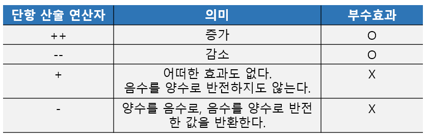
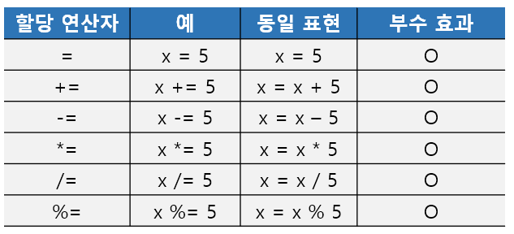
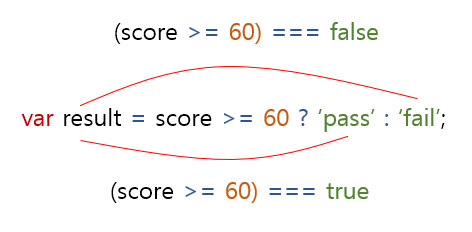
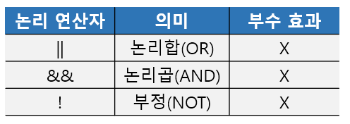
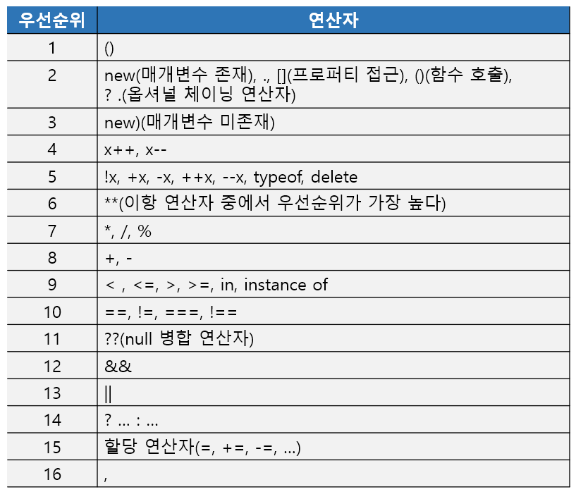

# 7장. 연산자

연산자는 하나 이상의 표현식을 대상으로 산술, 할당, 비교, 논리, 타입, 지수 연산 등을 수행해 하나의 값을 만든다. 

이때 연산의 대상을 피연산자라 한다.

#### 7.1 산술 연산자

산술 연산자는 피연산자를 대상으로 수학적 계산을 수행해 새로운 숫자 값을 만든다.

산술 연산이 불가능한 경우, NaN을 반환한다.

**[이항 산술 연산자]**

2개의 피연산자를 산술 연산하여 숫자 값을 만든다.


**[단항 산술 연산자]**

1개의 피연산자를 산술 연산하여 숫자 값을 만든다.




- 증가/감소(++/--)연산자는 피연자의 값을 변경하는 부수 효과가 있다.

```javascript
var x = 1;

// ++ 연산자는 피연자의 값을 변경하는 암묵적 할당이 이뤄진다.
x++; // x = x + 1
console.log(x) // 2

//-- 연산자는 피연자의 값을 변경하는 암묵적 할당이 이뤄진다.
x--; x = x - 1
console.log(x) // 1
```


- 증가/감소(++/--) 연산자는 위치에 의미가 있다.
  - 피연산자 앞에 위치한 전위 증가/감소 연산자는 먼저 피연산자의 값을 증가/감소시킨 후, 다른 연산을 수행한다.
  - 피연산자 뒤에 위치한 후위 증가/감소 연산자는 먼저 다른 연산을 수행한 후, 피연산자의 값을 증가/감소시킨다.

```javascript
vax x = 5, result;

// 선할당 후증가
result = x ++;
console.log(resutl, x); // 5 6

// 선증가 후할당
result = ++x;
console.log(result, x); // 7 7

// 선할당 후감소
result = x--;
console.log(result, x); // 7 6

// 선감소 후할당
result = --x;
console.log(result, x); // 5 5
```


- 숫자 타입이 아닌 피연산자에 + 단항 연산자를 사용하면 피연사자를 숫자 타입으로 변환한 값을 생성하여 반환한다. 

```javascript
var x = '1';

// 문자열을 숫자로 타입 변환
console.log(+x); // 1
console.log(x); // '1' => 부수 효과 없음.

x = true;
// 불리언 값을 숫자로 타입 변환
console.log(+x); // 1

x = false;
console.log(+x); // 0

// 문자열을 숫자 타입으로 변환할 수 없으므로 NaN을 반환
x = 'Hello';
console.log(+x); // NaN
```


[문자열 연결 연산자]

+연산자는 피연산자 중 하나 이상이 문자열인 경우 문자열 연결 연산자로 동작한다.

```javascript
// 문자열 연결 연산자
1 + '1'; // '12'

1 + true; // 2 => true는 1로 타입 변환된다.
1 + null; // 1 => null은 0으로 타입 변환된다.
```


#### 7.2 할당 연산자




#### 7.3 비교 연산자

[동등/일치 비교 연산자]

- 동등 비교(==) 연산자는 좌항과 우항의 피연산자를 비교할 때 먼저 암묵적 타입 변환을 통해 타입을 일치시킨 후 같은 값인지 비교한다.
- 일치 비교(===) 연산자는 좌항과 우항의 피연산자가 타입도 같고 값도 같은 경우에 한하여 true를 반환한다.


#### 7.4 삼항 조건 연산자

조건식 ? 조건식이 true일 때 반환할 값 : 조건식이 false일 때 반환할 값



#### 7.5 논리 연산자



#### 7.6 쉼표 연산자

쉼표 연산자는 왼쪽 피연산자부터 차례대로 피연산자를 평가하고 마지막 피연산자의 평가가 끝나면 마지막 피연산자의 평가 결과를 반환한다.

```javascript
var x, y, z;
x = 1, y = 2, z = 3; // 3
```


#### 7.7 그룹 연산자

소괄호로 감싸는 그룹연산자는 자신의 피연산자인 표현식을 가장 먼저 평가한다.

그룹 연산자는 연산자 우선순위가 가장 높다.


#### 7.8 typeof 연산자

typeof 연산자는 피연산자의 데이터 타입을 문자열로 반환한다.

다음의 7가지 문자열 중 하나를 반환한다.

- "string", "number", "boolean", "undefined", "symbol", "object", "function"

**[주의할 점]**

- null을 반환값에 없으므로 null값을 연산해보면 "object"를 반환한다.
- 값이 null타입인지 알고싶을 때는 typeof연산자가 아닌 일치 연산자(===)를 사용하자.
- 선언하지 않은 식별자를 typeof 연산자로 연산하면 에러가 발생하는 게 아니고 undefined를 반환한다.


#### 7.9 지수 연산자

ES7에서 도입된 지수 연산자는 좌항의 피연산자를 밑으로, 우항의 피연산자를 지수로 거듭 제곱하여 숫자 값을 반환한다.

```javascript
2 ** 2; // 4
```

지수 연산자는 이항 연산자 중에서 우선순위가 가장 높다.


#### 7.10 연산자 우선 순위

연산자 우선순위는 우선 순위가 높을수록 먼저 실행되는데 다 외우기엔 너무 많고 실수가 많을 수도 있으니 가장 높은 그룹 연산자를 사용해 운선순위를 명시적으로 조절하는 것을 권한다.

