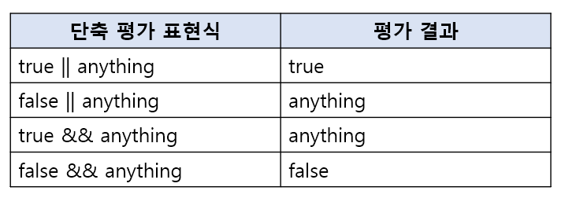

# 9장. 타입 변환과 단축 평가

#### 9.1 타입 변환이란?

개발자가 의도적으로 값의 타입을 변환하는 것을 **명시적 타입 변환 또는 타입 캐스팅**이라고 한다.

개발자의 의도와 상관없이 표현식을 평가하는 도중에 자바스크립트 엔진에 의해 암묵적으로 타입이 자동 변환되는 것을 **암묵적 타입 변환 또는 타입 강제 변환**이라고 한다.

명시적 타입 변환이나 암묵적 타입 변환이 기존 원시 값을 직접 변경하는 것은 아니다. 타입 변환이란 기존 원시 값을 사용해 다른 타입의 새로운 원시 값을 생성하는 것이다.


#### 9.2 암묵적 타입 변환

암묵적 타입 변환은 자바스크립트 엔진이 개발자의 의도와 상관없이 코드의 문맥을 고려해 암묵적으로 타입을 강제로 변환하는 경우다.

```javascript
// 피연산자가 모두 문자열 타입이어야 하는 문맥
'10' + 2 // '102'

// 피연산자가 모두 숫자 타입이어야 하는 문맥
5 * '10' // 50

// 피연산자 또는 표현식이 불리언 타입이어야 하는 문맥
!0 // true
if (1) { }
```

암묵적 타입 변환이 발생하면 문자열, 숫자, 불리언가 같은 원시 타입 중 하나로 타입을 자동 변환한다.

**[문자열 타입으로 변환]**

`+ 연산자`는 피연산자 중 하나 이상이 문자열일때 문자열 연결 연산자로 동작한다. 문자열 연결 연산자의 역할은 문자열 값을 만드는 것이다. 따라서 문자열 연결 연산자의 모든 피연산자는 코드의 문맥상 모두 문자열 타입이어야 한다.

```javascript
// 숫자 타입
0 + '' // "0"
-0 + '' // "0"
1 + '' // "1"
-1 + '' // "-1"
NaN + '' // "NaN"
Infinity + '' // "Infinity"
-Infinity + '' // "-Infinity"

// 불리언 타입
true + '' // "true"
false + '' // "false"

//null 타입
null + '' // "null"

// undefined 타입
undefined + '' // "undefined"

// 심벌 타입
(Symbol()) + '' // TypeError : Cannot convert a Symbol value to a string

// 객체 타입
({}) + '' // "[Object Object]"
Math + '' // "[Object Math]"
[] + '' // ""
[10, 20] + '' // "10,20"
(function(){}) + '' // "function(){}"
Array + '' // "function Array() { [native code] }"
```


**[숫자 타입으로 변환]**

`- 연산자`, `* 연산자`, `/ 연산자`는 모두 산술 연산자다. 산술 연산자의 역할은 숫자 값을 만드는 것이다. 따라서 산술 연산자의 모든 피연산자는 코드 문맥상 모두 숫자 타입이어야 한다. 하지만 숫자타입으로 타입 변환이 안되는 경우는 산술 연산을 진행할 수 없기 때문에 표현식의 평가 결과가 NaN이 된다.

```javascript
1 - '1' // 0
1 * '10' // 10
1 / 'one' // NaN
```

`+ 단항 연산자`는 피연산자가 숫자 타입의 값이 아니면 숫자 타입의 값으로 암묵적 타입 변환을 수행한다.

```javascript
// 문자열 타입
+'' // 0
+'0' // 0
+ '1' // 1
+'string' // NaN

// 불리언 타입
+true // 1
+false // 0

// null 타입
+null // 0

// undefined 타입
+undefined // NaN

// 심벌 타입
+Symbol() // TypeError : Cannot convert a Symbol value to a number

// 객체 타입
+{} // NaN
+[] // 0
+[10, 20] // NaN
+(function(){}) // NaN
```

주의!

빈 문자열(''), 빈 배열([]), null, false는 0으로, true는 1로 변환된다. 객체와 빈 배열이 아닌 배열, undefined는 변환되지 않아 NaN이 된다는 것에 주의하자.


**[불리언 타입 변환]**

if 문이나 for 문과 같은 제어문 또는 삼항 조건 연산자의 조건식은 불리언 값, 즉 논리적 참/거짓으로 평가되어야 하는 표현식이다. 자바스크립트 엔진은 조건식의 평가 결과를 불리언 타입으로 암묵적 타입 변환한다.

```javascript
if ('') console.log('1');
if (true) console.log('2');
if (0) console.log('3');
if ('str') console.log('4');
if (null) console.log('5');

// 2 4
```

자바 스크립트 엔진은 불리언 타입이 아닌 값을 **Truthy 값(참으로 평가되는 값) 또는 Falsy 값(거짓으로 평가되는 값)으로 구분**한다.

즉, 제어문의 조건식과 같이 불리언 값으로 평가되어야 할 문맥에서 Truthy값은 true로, Falsy값은 false로 암묵적 타입 변환된다.

false로 평가되는 Falsy 값에는 다음과 같은 값들이 있다. Falsy 값 외의 모든 값은 모두 true로 평가되는 Truthy 값이다.

- false, undefined, null, 0, -0, NaN, ''(빈 문자열)

#### 9.3 명시적 타입 변환

개발자의 의도에 따라 명시적으로 타입을 변경하는 방법은 다양하다.

1. 표준 빌트인 생성자 함수(String, Number, Boolean)을 new 연산자 없이 호출하는 방법
2. 빌트인 메서드를 사용하는 방법
3. 암묵적 타입 변환을 이용하는 방법


**[문자열 타입 변환]**

1. String 생성자 함수를 new 연산자 없이 호출하는 방법
2. Object.prototype.toString 메서드를 사용하는 방법
3. 문자열 연결 연산자를 이용하는 방법

```javascript
// 1번 String 생성자 함수를 new 연산자 없이 호출하는 방법
// 숫자 타입 => 문자열 타입
String(1); // "1"
String(NaN); // "NaN"
String(Infinity) // "Infinity"
//불리언 타입 => 문자열 타입
Stirng(true); // "ture"
String(false); // "false"

// 2번 Object.prototype.toString 메서드를 사용하는 방법
// 숫자 타입 => 문자열 타입
(1).toString(); // "1"
(NaN).toString(); // "NaN"
(Infinity).toString(); // "Infinity"
// 불리언 타입 => 문자열 타입
(true).toString(); // "true"
(false).toString(); // "false"

// 3번 문자열 연결 연산자를 이용하는 방법
// 숫자 타입 => 문자열 타입
1 + ''; // "1"
NaN + ''; // "NaN"
Infinity + ''; // "Infinity"
// 불리언 타입 => 문자열 타입
true + ''; // "true"
false + ''; // "false"
```


**[숫자 타입으로 변환]**

1. Number 생성자 함수를 new 연산자 없이 호출하는 방법
2. parseInt.parseFloat 함수를 사용하는 방법(문자열만 숫자 타입으로 변환 가능)
3. +단항 산술 연산자를 이용하는 방법
4. *산술 연산자를 이용하는 방법

```javascript
// 1번 Number 생성자 함수를 new 연산자 없이 호출하는 방법
// 문자열 타입 => 숫자 타입
Number('0'); // 0
Number('-1'); // -1
Number('10.53'); // 10.53
// 불리언 타입 => 숫자 타입
Number(true); // 1
Number(false); // 0

//2번 parseInt.parseFloat 함수를 사용하는 방법(문자열만 숫자 타입으로 변환 가능)
// 문자열 타입 => 숫자 타입
parseInt('0'); // 0
parseInt('-1'); // -1
parseInt('10.53'); // 10.53

// 3번 +단항 산술 연산자를 이용하는 방법
// 문자열 타입 => 숫자 타입
+'0'; // 0
+'-1'; // -1
+'10.53'; // 10.53
// 불리언 타입 => 숫자 타입
+true; // 1
+false; // 0

// 4번 *산술 연산자를 이용하는 방법
// 문자열 타입 => 숫자 타입
'0' * 1; // 0
'-1' * 1; // -1
'10.53' * 1; // 10.53
// 불리언 타입 => 숫자 타입
true * 1; // 1
false * 1; // 0
```


**[불리언 타입 변환]**

1. Boolean 생성자 함수를 new연산자 없이 호출하는 방법
2. ! 부정 논리 연산자를 두 번 사용하는 방법

```javascript
// 1번 Boolean 생성자 함수를 new연산자 없이 호출하는 방법
// 문자열 타입 => 불리언 타입
Boolean('x'); // true
Boolean(''); // false
Boolean('false') // ture
// 숫자 타입 => 불리언 타입
Boolean(0); // false
Boolean(1); // true
Boolean(NaN); // false
Boolean(Infinity); // true
// null 타입 => 불리언 타입
Boolean(null); // false
// undefined 타입 => 불리언 타입
Boolean(undefined); // false
// 객체 타입 => 불리언 타입
Boolean({}); // true
Boolean([]); // true

// 2번 ! 부정 논리 연산자를 두 번 사용하는 방법
// 문자열 타입 => 불리언 타입
!!'x'; // true
!!''; // false
!!'false'; // true
// 숫자 타입 => 불리언 타입
!!0; // false
!!1; // true
!!NaN; // false
!!Infinity; // true
// null 타입 => 불리언 타입
!!null; // false
// undefined 타입 => 불리언 타입
!!undefined; // false
// 객체 타입 => 불리언 타입
!!{}; // true
!![]; // true
```


#### 9.4 단축 평가

단축 평가는 표현식을 평가하는 도중에 평가 결과가 확정된 경우 나머지 평가 과정을 생략하는 것을 말한다.

**[논리 연산자를 사용한 단축 평가]**

"논리합(||) 또는 논리곱(&&) 연산자 표현식의 평가 결과는 불리언 값이 아닐 수 있다. 논리합(||) 또는 논리곱(&&) 연산자 표현식은 언제나 2개의 피연산자 중 어느 한쪽으로 평가된다"

논리곱(&&) 연산자

두 개의 피연산자가 모두 true로 평가될 때 true를 반환한다. 논리곱 연산자는 좌항에서 우항으로 평가가 진행된다. 그래서 항상 두 번재 피연산자까지 평가해 보아야 논리곱 표현식을 평가할 수 있는데, 이때 **논리곱 연산자는 논리 연산의 결과를 결정하는 두 번째 피연산자를 그대로 반환**한다.

```javascript
'Cat' && 'Dog' // "Dog"
```


논리합(||) 연산자

두 개의 피연산자 중 하나만 true로 평가되어도 true를 반환한다. 그래서 첫 번째 피연산자가 true로 평가되면 굳이 두 번째 피연산자까지 평가해보지 않아도 된다. 이 때 논리합 연산자는 **논리 연산의 결과를 결정한 첫 번째 피연산자를 그대로 반환**한다.

```javascript
'Cat' || 'Dog' // "Cat"
```

논리곱 연산자와 논리합 연산자는 이처럼 논리 연산의 결과를 결정하는 피연산자를 타입 변환하지 않고 그대로 반환한다.

단축 평가는 다음과 같은 규칙을 따른다.



단축평가는 다음과 같은 상황에서 유용하게 사용된다.

1. **객체를 가리키기를 기대하는 변수가 null 또는 undefined가 아닌지 확인하고 프로퍼티를 참조할 때**

​	객체는 키와 값으로 구성된 프로퍼티의 집합이다. 만약 객체를 가리키기를 기대하는 변수가 null 또는 undefined인 경우 객체의 프로퍼	티를 참조하면 타입 에러가 발생한다. 이 때 단축 평가를 사용하면 에러를 발생시키지 않는다.

```javascript
var elem = null;
var value = elem.value; // TypeError : Cannot read property 'value' of null

// 단축 평가를 사용했을 때
var elem = null;
// elem이 null이나 undefined와 같은 Falsy 값이면 elem으로 평가되고
// elem이 Truthy 값이면 elem.value로 평가된다.
var value = elem && elem.value; // null
```


2. **함수 매개변수에 기본값을 설정할 때**

​	함수를 호출할 때 인수를 전달하지 않으면 매개변수에는 undefined가 할당된다. 이때 단축 평가를 사용해 매개변수의 기본값을 설정하	면 undefined로 인해 발생할 수 있는 에러를 방지 할 수 있다.

```javascript
function getStringLength(str) {
    str = str || '';
    return str.length;
} 
getStringLength(); // 0
getStringLength('hi'); // 2
```


**[옵셔널 체이닝 연산자]**

ES11에서 도입된 옵셔널 체이닝 연산자 ?.는 좌항의 피연산자 null 또는 undefined인 경우 undefined를 반환하고, 그렇지 않으면 우항의 프로퍼티 참조를 이어간다.

```javascript
var elem = null;

//elem이 null 또는 undefined이면 undefined를 반환하고, 그렇지 않으면 우항의 프로퍼티 참조를 이어간다.
var value = elem?.value;
console.log(value); // undefined
```

옵셔널 체이닝 연산자 ?.는 객체를 가리키기를 기대하는 변수가 null 또는 undefined가 아닌지 확인하고 프로퍼티를 참조할 때 유용하다.

옵셔널 체이닝 연산자가 도입되기 전에는 논리 연산자 &&(논리곱)를 사용해서 변수가 null 인지 undefined인지를 확인하였는데, 이때 생기는 문제점이 논리 연산자 &&는 좌항 피연산자가 false로 평가되는 Falsy 값(false, undefined, null, 0, -0, NaN, '')이면 좌항 피연산자를 그대로 반환한다. 하지만 0이나 ''은 객체로 평가될 때도 있다. 이런 상황에서 논리 연산자 &&을 사용하기에는 프로퍼티를 참조하지 못할 때가 생긴다.

```javascript
// 논리 연산자 &&
var str = '';
// 문자열의 길이(length)를 참조한다.
var length = str && str.length;
// 문자열의 길이(length)를 참조하지 못한다.
console.log(length); // ''

// 옵셔널 체이닝 연산자
var length = str?.length;
console.log(length); // 0
```


**[null 병합 연산자]**

ES11에 도입된 null 병합 연산자 ??는 좌항의 피연산자가 null 또는 undefined인 경우 우항의 피연산자를 반환하고, 그렇지 않으면 좌항의 피연산자를 반환한다. null 병합 연산자 ??는 변수에 기본값을 설정할 때 유용하다.

```javascript
// 좌항의 피연산자가 null 또는 undefined이면 우항의 피연산자를 반환하고,
// 그렇지 않으면 좌항의 피연산자를 반환한다.
var foo = null ?? 'default string';
console.log(foo); // "default string"
```

null 병합 연산자 도입 이전에는 논리 연산자 ||를 사용한 단축 평가를 통해 변수에 기본값을 설정했다. 논리 연산자 ||를 사용한 단축 평가의 경우 좌항의 피연산자가 false로 평가되는 Falsy 값이면 우항의 피연산자를 반환한다. 만약 Falsy 값인 0이나 ''도 기본값으로서 유효하다면 예기치 않은 동작이 발생할 수 있다.

```javascript
// 논리 연산자 ||
var foo = '' || 'default string';
console.log(foo); // "default string"

// null 병합 연산자
var foo = '' ?? 'default string';
console.log(foo); // ''
```

